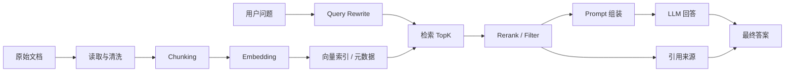

# RAG 总览

## 本章目标

这一章是整套 RAG 专题的总入口。你不只会知道 RAG 是什么，还会知道它为什么会成为企业级 LLM 应用的基础设施，以及后面每一章分别在解决什么问题。

读完后你应该能：

- 讲清楚 RAG 的完整链路
- 区分 RAG、Tool Calling、纯 Prompt 的边界
- 理解一个 RAG 系统为什么往往不是“一把梭”工程
- 知道后续优化点分别属于哪一层

---

## 为什么 RAG 几乎是企业应用必修课

如果你做的是通用聊天机器人，只靠模型本体有时已经能工作得不错。

但一旦进入真实业务场景，你马上会遇到这些问题：

- 模型不知道你公司的私有知识
- 模型不知道昨天刚更新的制度和文档
- 模型回答缺乏引用来源，用户不敢信
- 模型可能会把“似乎合理”的内容说得像真的

这时，RAG 的价值就出来了。

一句话说清楚：

> RAG 的目标不是让模型凭空变聪明，而是让模型在回答时尽量基于可追溯的外部依据。

---

## RAG 的工程定义

从工程角度看，RAG 可以定义为：

> 一个把外部文档知识转化为可检索上下文，并在回答阶段把这些上下文喂给模型的系统。

这里面其实隐含了两条链路：

- 离线链路：文档处理、清洗、切块、向量化、建索引
- 在线链路：用户提问、查询改写、检索召回、重排、生成回答、引用展示

这两条链路缺一不可。

---

## RAG 总流程图



---

## 你可以把 RAG 拆成五层来理解

### 第一层：数据层

解决“知识从哪里来”。

包括：

- PDF、Markdown、HTML、数据库记录
- 文档版本管理
- 文档更新机制

### 第二层：索引层

解决“知识怎样变成可检索形式”。

包括：

- 文本清洗
- 切块策略
- embedding
- 向量索引
- metadata

### 第三层：召回层

解决“如何把最相关的内容找回来”。

包括：

- 向量检索
- 关键词检索
- 混合检索
- metadata filter
- rerank

### 第四层：生成层

解决“如何基于依据回答”。

包括：

- Prompt 约束
- 依据引用
- 不足信息处理
- 结构化输出

### 第五层：工程化层

解决“如何把它做成稳定系统”。

包括：

- 评测
- 缓存
- 索引更新
- 失败样本分析
- 成本与监控

---

## RAG 和 Tool Calling 的区别

这是面试里几乎必问的问题。

### RAG 解决什么

- 模型缺少知识依据
- 模型要查文档、查制度、查说明书

### Tool Calling 解决什么

- 模型要查询实时状态
- 模型要调接口、执行动作

一句话区分：

> RAG 更偏“查知识”，Tool Calling 更偏“做事情”。

很多系统最后会把两者结合起来：

- 先用 RAG 查规则
- 再用 Tool Calling 查实时状态
- 最后综合回答

---

## RAG 的典型系统形态

### 形态一：文档问答

最典型，也是最适合初学者做第一个项目的场景。

例如：

- 企业制度问答
- 产品文档问答
- 客服 FAQ 问答

### 形态二：搜索增强助手

不是直接给最终答案，而是先给检索结果和摘要。

适合：

- 研发知识搜索
- 代码文档检索
- 项目内部 wiki 检索

### 形态三：工作流中的知识节点

RAG 不是最终应用，而是 Agent 流程中的一个“取依据”节点。

例如：

- Ticket Agent 先检索 FAQ，再决定是否调工具
- 销售助手先查产品资料，再生成答复

---

## 最小可运行认知示例

下面这段代码不是完整生产版 RAG，但它能帮助你抓住主线：

```python
def build_rag_prompt(question: str, contexts: list[str]) -> str:
    joined = "\n\n".join(
        f"资料{i + 1}:\n{ctx}" for i, ctx in enumerate(contexts)
    )
    return f"""
    你是一名企业知识库问答助手。
    请严格依据给定资料回答问题。
    如果资料不足，请明确说“资料不足，无法确定”。

    {joined}

    问题：{question}
    """
```

这段代码体现了 RAG 的核心思想：

- 先找到资料
- 再明确告诉模型“只能基于资料回答”

---

## 一个真实业务例子

### 例子：公司年假制度问答

用户提问：

```text
年假最多能结转几天？
```

如果不用 RAG：

- 模型可能回答一个通用劳动法相关说法
- 但不一定等于你公司的真实制度

如果用 RAG：

- 系统先从人事制度文档中检索“年假”“结转”“有效期”相关条款
- 再把条款内容喂给模型
- 模型回答时附上条款摘要或引用来源

这样用户就更愿意相信答案。

---

## 学习 RAG 时最容易踩的误区

### 误区 1：只盯模型，不盯数据

很多 RAG 问题其实是数据清洗、chunking、检索没做好。

### 误区 2：只看最终回答，不拆分召回问题和生成问题

如果正确文档根本没召回，再好的模型也没法回答。

### 误区 3：以为接了向量库就等于做完 RAG

真正决定效果的通常是：

- 文档质量
- 切块策略
- 召回策略
- Prompt 约束
- 评测闭环

### 误区 4：不展示来源

没有引用来源的 RAG，用户信任感通常会显著下降。

---

## 本专题你将按什么顺序学

本模块会按真实工程主线展开：

1. [文档处理](./document-processing)
2. [切块策略](./chunking)
3. [Embedding 与向量存储](./embedding-vector-store)
4. [检索策略](./retrieval)
5. [Rerank](./rerank)
6. [混合检索](./hybrid-search)
7. [Query Rewrite](./query-rewrite)
8. [RAG 评测](./rag-evaluation)
9. [RAG 生产实践](./rag-production)

你会发现这不是“一个技巧”，而是一条完整工程链路。

---

## 本章小结

你现在最应该记住的是：

- RAG 的核心目标是“让模型基于依据回答”
- 它是一套系统，不是一个单点 API
- RAG 的效果取决于数据、切块、检索、重排、Prompt 和评测的共同质量
- 企业里真正可用的 RAG，必须把可解释性和工程稳定性一起考虑

---

## 练习题

1. 用你自己的话解释 RAG 的完整链路
2. 举 3 个适合用 RAG 的场景，举 2 个不适合只靠 RAG 的场景
3. 解释 RAG 和 Tool Calling 的区别
4. 画出一个你理解中的 RAG Mermaid 图

---

## 下一章

RAG 的第一步不是 embedding，而是先把数据变干净：[文档处理](./document-processing)
