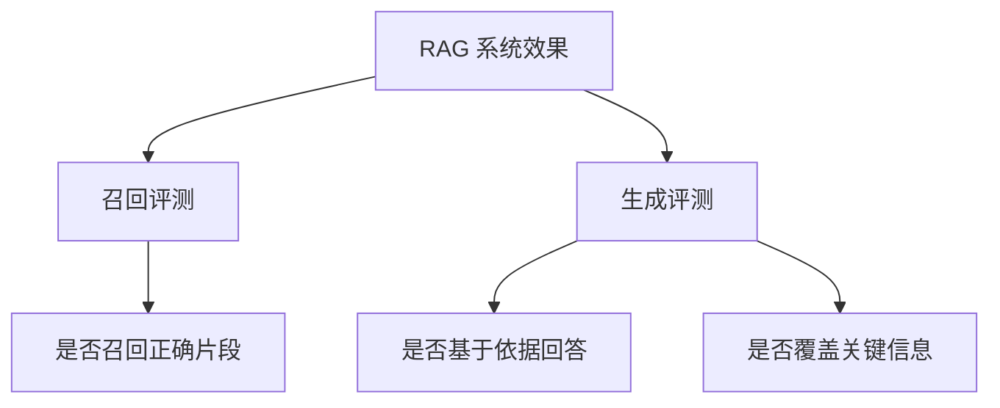

# RAG 评测

## 本章目标

这一章讨论一个非常工程化的话题：如何评估 RAG 系统，而不是只靠“我觉得回答好像不错”。

读完后你应该能：

- 理解为什么要把召回和生成分开评测
- 设计最小评测集
- 写出一个基础评测脚本
- 知道如何根据评测结果定位问题

---

## 为什么 RAG 一定要评测

因为 RAG 的链路很长：

- 文档处理
- 切块
- embedding
- 检索
- rerank
- Prompt
- 生成

任何一环出问题，最终回答都可能变差。

如果你不做评测，就很容易陷入：

- 改了 Prompt，不知道是不是变好
- 换了 chunk_size，不知道是不是更准
- 加了 rerank，不知道值不值

---

## 评测总图



---

## 1. 为什么要拆成“召回评测”和“生成评测”

这是 RAG 评测里最重要的原则。

### 召回评测关心什么

- 正确片段有没有进入 TopK
- 检索是否把证据找回来了

### 生成评测关心什么

- 模型是否基于证据回答
- 模型是否有编造
- 模型是否遗漏关键点

如果你不拆分，就很难定位问题到底出在哪一层。

---

## 2. 一个最小评测集长什么样

```python
test_cases = [
    {
        "question": "年假最多能结转几天？",
        "expected_keyword": "5天",
        "expected_doc": "hr_policy_annual_leave",
    },
    {
        "question": "试用期离职需要提前多久？",
        "expected_keyword": "提前3天",
        "expected_doc": "hr_policy_probation_exit",
    },
]
```

这里同时保留：

- 问题
- 期望答案关键词
- 期望命中的文档或条款

这样你才能同时做召回和生成评测。

---

## 3. 一个最小评测脚本

```python
def run_eval(answer_fn):
    passed = 0
    for case in test_cases:
        answer = answer_fn(case["question"])
        if case["expected_keyword"] in answer:
            passed += 1
    print(f"passed: {passed}/{len(test_cases)}")
```

这是最基础版本。虽然不完美，但已经比“凭感觉调系统”专业很多。

---

## 4. 如何做召回评测

你需要记录每次问题的检索结果，然后判断：

- 正确 chunk 是否在 TopK 中
- 正确文档是否命中
- 排名是否足够靠前

这可以帮你定位：

- chunking 有没有问题
- retrieval 有没有问题
- rerank 有没有问题

---

## 5. 如何做生成评测

可以先用最朴素的方法评估：

- 是否包含关键结论
- 是否明显编造
- 是否覆盖核心信息点

在项目初期，这种规则评测已经很有价值。

---

## 6. 两个业务案例

### 案例一：制度问答

如果回答错了，你要先看：

- 是不是根本没召回正确条款
- 还是召回到了，但模型没用好

### 案例二：研发知识库问答

如果回答太泛，你要看：

- 是不是 chunk 太大导致检索命中了“泛说明”
- 还是 Prompt 没要求模型引用依据

---

## 7. 评测闭环应该怎么用

一个更像工程师的工作方式是：

1. 先准备一批真实问题样本
2. 保存当前评测结果
3. 修改一处策略，比如 chunk_size 或 top_k
4. 重新跑评测
5. 比较前后差异

只有这样，你才能说自己是在“优化系统”，而不是“试手气”。

---

## 8. 常见坑

### 坑一：只看最终回答分数

这样很难定位问题层次。

### 坑二：样本太少

几个问题可能看不出真实规律。

### 坑三：评测集和真实问题差别太大

会导致线上体验和离线评测不一致。

### 坑四：改很多参数，但不记录版本

最终会失去可追踪性。

---

## 本章小结

本章最核心的结论是：

- RAG 必须评测
- 评测必须拆成“召回”和“生成”两层
- 有了评测集，优化才有依据
- 没有评测闭环，RAG 调优几乎一定会混乱

---

## 练习题

1. 为你的知识库准备 10 个评测问题
2. 给每个问题标注一个期望命中文档
3. 写一个最小评测脚本
4. 试着对比两种 `top_k` 设置下的评测结果

---

## 下一章

最后进入更贴近真实项目的一章：[RAG 生产实践](./rag-production)
