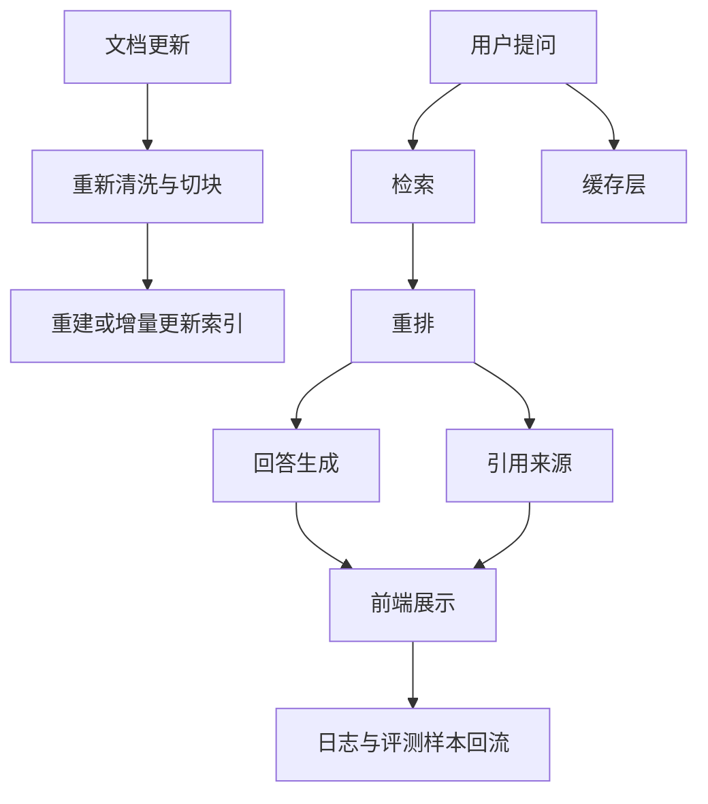

# RAG 生产实践

## 本章目标

这一章把前面的 RAG 理论和实验主线，拉到更接近真实项目落地的层面。

读完后你应该能：

- 理解生产级 RAG 关注的不只是“能回答”
- 知道索引更新、缓存、引用展示、日志和成本控制的重要性
- 用工程视角看待 RAG 系统上线后的问题

---

## 生产级 RAG 和教学 Demo 的区别

一个 Demo 往往只关心：

- 能不能回答

而生产级 RAG 要关心：

- 回答是否可信
- 来源能否追溯
- 文档更新是否及时生效
- 热门问题是否可以缓存
- 成本和延迟是否可控
- 失败时用户体验如何

这就是为什么真实企业里的 RAG 远不止“加一个向量库”。

---

## 生产链路示意图

---

## 1. 索引更新为什么重要

很多人做 Demo 时只导一次文档，然后就结束了。

但企业文档是会变的：

- 制度会更新
- 产品文档会发布新版本
- FAQ 会增加新条目

因此生产系统要考虑：

- 全量重建索引
- 增量更新索引
- 文档版本管理

否则系统会出现一个经典问题：

> 文档已经改了，但机器人还在按旧内容回答。

---

## 2. 引用展示非常关键

RAG 最大的一个产品价值，不只是“答对”，而是：

> 用户能看到你是依据什么答的。

前端上常见的展示方式：

- 答案下方显示来源卡片
- 展示命中文档标题
- 可展开原文片段
- 高亮命中关键词

这对用户信任提升非常明显。

---

## 3. 缓存策略

RAG 系统常见缓存点：

### embedding 缓存

对于重复文本或热门问题，可以减少重复 embedding 成本。

### 热门问题缓存

某些高频问题直接缓存最终回答或中间检索结果。

### 检索结果缓存

如果知识库变化不频繁，这种缓存也会带来明显收益。

---

## 4. 日志和问题回流

生产系统上线后，你最宝贵的数据之一就是：

- 用户真实问题
- 检索结果
- 最终回答
- 用户是否追问或不满意

这些数据非常适合回流到：

- 评测集扩充
- 失败样本分析
- chunking 和 retrieval 优化

这会形成持续迭代闭环。

---

## 5. 成本控制

RAG 的成本不只来自生成模型，还包括：

- embedding
- rerank
- 多轮查询改写
- 较大的上下文拼接

因此生产优化常见方向有：

- 减少无效 chunk
- 控制 top_k
- 仅对必要问题启用 query rewrite 或 rerank
- 对热门问题缓存结果

---

## 6. 失败时怎么兜底

生产系统要考虑：

- 检索不到内容怎么办
- 检索到内容但置信度低怎么办
- 文档冲突怎么办

常见兜底方式：

- 明确回复“资料不足，无法确定”
- 提供最相关参考文档让用户自己查看
- 引导用户联系人工支持

---

## 7. 两个业务案例

### 案例一：企业制度助手

生产关注点：

- 制度更新后的索引重建
- 答案引用条款展示
- 敏感制度权限控制

### 案例二：研发知识库助手

生产关注点：

- 文档版本区分
- 错误问题日志回流
- 热门问题缓存
- 前端高亮引用和原文跳转

---

## 8. 常见坑

### 坑一：Demo 能跑就直接当成产品

没有索引更新、没有引用展示、没有缓存、没有日志的 RAG，很难长期可用。

### 坑二：只看回答，不看用户信任

没有来源展示，用户很难真正信任系统。

### 坑三：所有优化一起上

一开始就把 query rewrite、hybrid、rerank、缓存全加上，系统会很复杂，难以定位问题。

更合理的方式是：

- 先跑通主链路
- 再按评测结果逐步加能力

---

## 本章小结

你现在应该能建立一个更真实的认知：

- 生产级 RAG 的关键不只是“答得出来”
- 还包括来源可解释、索引可更新、日志可观测、成本可控制、失败可兜底
- 真正的企业 RAG，是一个持续演进的系统，而不是一次性拼装的 Demo

---

## 练习题

1. 为你的 RAG 项目设计一个引用展示方案
2. 写出你认为最需要缓存的 2 个节点
3. 设计一个“资料不足”的兜底回答模板
4. 列出 5 个你希望上线后持续观察的日志字段

---

## 下一章

RAG 专题学完后，接下来进入多步系统组织能力：[Agent 导论](../agent/index)
