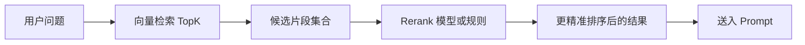

# Rerank

## 本章目标

这一章讨论 RAG 检索优化里的一个关键中间层：`rerank`，也就是重排。

读完后你应该能：

- 理解为什么只靠向量相似度排序经常不够
- 明白 rerank 在召回链路里的位置
- 知道哪些场景特别需要 rerank

---

## 为什么向量检索后还要再排一次

向量检索的特点是：

- 擅长快速找一批“可能相关”的候选
- 但不一定能把最适合当前问题的片段精确排在最前面

而 Rerank 的作用就是：

> 对候选结果做更精细的相关性判断，再重新排序。

你可以把它理解成两阶段：

- 第一阶段：粗召回
- 第二阶段：精排序

---

## 流程图



---

## 1. Rerank 在什么场景特别有用

### 场景一：文档内容相似度普遍较高

例如制度文档里很多条款都带“休假”“审批”“员工”等相似词。

### 场景二：问题比较细，但候选很多

例如：

```text
支付成功但订单状态未更新，系统建议怎么处理？
```

可能会召回很多“支付”“订单”“状态”的相关片段，但真正最关键的那一段需要更细粒度判断。

### 场景三：你希望降低上下文噪声

向量检索先取前 10 条，再用 rerank 压缩成前 3 条，通常比直接只取前 3 条更稳。

---

## 2. 如何理解 rerank 的工程价值

你可以把检索阶段拆成：

- retrieval：先别漏掉正确答案
- rerank：再尽量把最有用的内容放前面

所以 rerank 的价值不是“替代检索”，而是“优化检索的排序质量”。

---

## 3. 一个教学化的重排思路

哪怕暂时没有专门 rerank 模型，你也可以先用简单规则理解它：

```python
def rerank_candidates(question: str, candidates: list[dict]) -> list[dict]:
    keywords = question.split()

    def score(item: dict) -> int:
        text = item["text"]
        return sum(1 for keyword in keywords if keyword in text)

    return sorted(candidates, key=score, reverse=True)
```

这当然不是生产级做法，但它能帮助你理解：

- 候选先召回
- 再按更细规则排序

---

## 4. 两个业务案例

### 案例一：企业规章问答

问题：

```text
试用期离职是否需要提前 30 天？
```

可能召回：

- 劳动合同解除规则
- 试用期说明
- 离职通知流程

这些都相关，但最重要的是“试用期提前通知规则”那一段。rerank 就是帮助你把它推到更前面。

### 案例二：研发知识库

问题：

```text
chunk load error 导致白屏怎么排查？
```

可能召回多篇“构建”“部署”“缓存”“CDN”相关文档。rerank 可以帮助更优先选中真正讲 `chunk load error` 的片段。

---

## 5. rerank 带来的代价

rerank 通常不是白赚的，它也会增加：

- 调用成本
- 延迟
- 链路复杂度

所以不是任何场景都必须上 rerank。

如果你的数据量小、文档结构清晰、召回已经很稳，rerank 的边际收益可能没有那么大。

---

## 6. 常见坑

### 坑一：把 rerank 当成万能补丁

如果前面的 chunking 和 retrieval 本身就很差，rerank 也救不了太多。

### 坑二：候选集太少还想 rerank

如果只召回 2 条候选，重排空间很有限。

### 坑三：不评估 rerank 的真实收益

有时加了 rerank 成本变高，但效果未必明显提升。

---

## 本章小结

你现在应该记住：

- 向量检索解决“先找回来”
- rerank 解决“把最该看的排前面”
- rerank 很适合候选较多、语义接近、噪声较多的场景
- 但它不是替代前面链路的万能修复器

---

## 练习题

1. 用简单关键词打分方式实现一个教学版 rerank
2. 比较“只取 Top3”和“Top10 后 rerank 取 Top3”的差异
3. 找一个你认为特别需要 rerank 的业务场景，并说明原因

---

## 下一章

除了向量检索，很多系统还会结合关键词检索：[混合检索](./hybrid-search)
