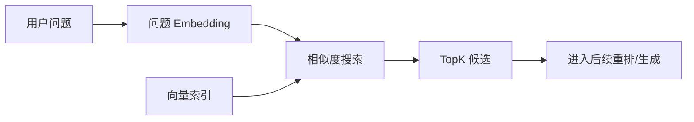

# 检索策略

## 本章目标

这一章讨论 RAG 在线链路里最关键的一步：检索。

读完后你应该能：

- 理解检索在 RAG 中的真正作用
- 写出一个最小相似度搜索示例
- 理解 `top_k`、过滤条件、噪声控制的基本思路
- 知道很多 RAG 问题其实首先是检索问题

---

## 为什么检索是 RAG 的核心

模型最终能不能答对，很大程度上取决于：

> 相关资料有没有被找回来。

如果正确片段根本没有召回，后面再好的 Prompt、再强的模型，也只是“在错误上下文上努力回答”。

---

## 检索流程图



---

## 1. 一个最小相似度搜索示例

```python
from dataclasses import dataclass
import math


@dataclass
class DocChunk:
    text: str
    embedding: list[float]
    metadata: dict


def cosine_similarity(a: list[float], b: list[float]) -> float:
    dot = sum(x * y for x, y in zip(a, b))
    norm_a = math.sqrt(sum(x * x for x in a))
    norm_b = math.sqrt(sum(x * x for x in b))
    if norm_a == 0 or norm_b == 0:
        return 0.0
    return dot / (norm_a * norm_b)


def top_k_search(query_embedding: list[float], chunks: list[DocChunk], k: int = 3) -> list[DocChunk]:
    scored = [
        (chunk, cosine_similarity(query_embedding, chunk.embedding))
        for chunk in chunks
    ]
    scored.sort(key=lambda item: item[1], reverse=True)
    return [item[0] for item in scored[:k]]
```

这个例子很重要，因为它把检索本质讲得非常清楚：

- 算相似度
- 排序
- 取前 K 条

---

## 2. `top_k` 为什么不只是一个参数

很多人把 `top_k` 当成一个随便改的数字，但它实际决定的是：

- 给模型喂多少证据
- 召回漏掉关键片段的风险
- 引入噪声的风险

### `top_k` 太小

- 可能漏掉关键内容

### `top_k` 太大

- 上下文变脏
- 噪声片段增多
- 成本变高

因此 `top_k` 的选择通常需要结合：

- 文档长度
- chunk 粒度
- 问题复杂度

---

## 3. metadata filter 的价值

现实项目里，检索通常不是“全库盲搜”，而是先筛范围，再做相似度搜索。

比如：

- 只查“人事制度”类文档
- 只查某个产品版本的文档
- 只查某个部门知识库

这类 filtering 往往能显著提升精度。

---

## 4. 一个带过滤条件的检索思路

```python
def filter_chunks(chunks: list[DocChunk], department: str) -> list[DocChunk]:
    return [
        chunk for chunk in chunks
        if chunk.metadata.get("department") == department
    ]
```

然后你可以先过滤，再做 `top_k_search`。

---

## 5. 检索结果不是“答案”，只是候选依据

这是非常关键的一点。

检索系统负责的是：

- 尽量召回相关证据

它不负责：

- 组织最终答案
- 比较多个证据的冲突
- 用自然语言解释给用户

这些是后面生成层的工作。

---

## 6. 两个业务案例

### 案例一：制度问答

用户问：

```text
试用期离职需要提前多久？
```

理想检索结果应该优先命中：

- “试用期”
- “离职”
- “提前通知”

而不是命中“劳动合同通用定义”这种泛条款。

### 案例二：API 文档检索

用户问：

```text
上传接口支持哪些文件类型？
```

理想结果应该命中接口参数说明，而不是整篇“文件系统概览”。

这说明：

- 好检索需要好 chunk
- 也需要合理过滤与排序

---

## 7. 如何判断是检索问题还是生成问题

一个非常实用的排查方法：

### 先看召回结果

如果检索结果里压根没有正确片段，那就是检索问题。

### 再看最终答案

如果正确片段已经召回，但模型还是答歪了，那更多是生成问题。

这就是为什么 RAG 调试必须拆成两层：

- retrieval
- generation

---

## 8. 常见坑

### 坑一：只关注最终回答，不看检索结果

这样你很难知道问题到底出在哪。

### 坑二：全库检索，不做任何过滤

数据一多，噪声通常会明显上升。

### 坑三：`top_k` 固定不动，从不实验

不同文档类型和问题类型，最优 `top_k` 往往不同。

### 坑四：把相似度高误认为“绝对正确”

相似度高只是候选相关，不等于它一定是最适合作答的片段。

---

## 本章小结

这一章你最该记住的是：

- 检索是 RAG 链路中的核心基础能力
- `top_k`、过滤条件、噪声控制都直接影响结果
- 评估 RAG 时必须先看召回，再看回答
- 很多所谓“模型答不好”的问题，实际上首先是检索没做好

---

## 练习题

1. 用内存数据实现一个最小 `top_k_search`
2. 给 chunk 增加 `department` metadata，并实现过滤
3. 用 5 个问题样本，观察 `top_k=2` 和 `top_k=5` 的差异
4. 找一个例子，判断它是检索问题还是生成问题

---

## 下一章

很多时候只靠向量排序还不够精准，接下来学习：[Rerank](./rerank)
