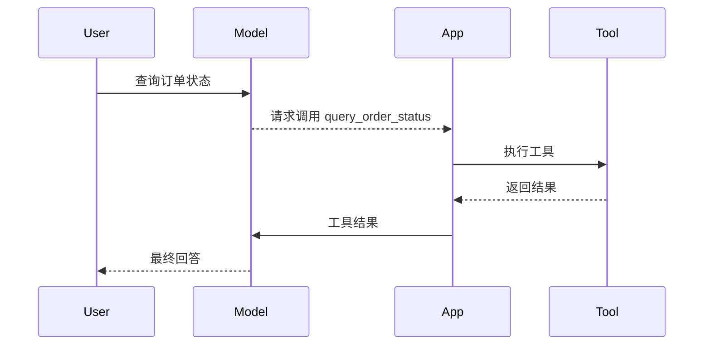

# 工具调用导论

## 本章目标

这一章是工具调用模块的入口，帮你建立整体理解：模型为什么需要工具，以及工具调用在应用架构中处于什么位置。

---

## 为什么模型需要工具

模型擅长语言理解和生成，但它默认不能：

- 查询实时天气
- 访问公司内部订单系统
- 操作数据库
- 发消息或执行动作

要解决这些问题，就需要 Tool Calling。

---

## 一张图看懂工具调用

---

## 模块内容预告

这一模块会继续展开：

- 工具调用基础机制
- 工具 schema 设计
- 工具路由与执行
- 工具安全与权限边界

---

## 本章小结

Tool Calling 的本质不是“模型真的会执行代码”，而是“模型参与决定何时调用什么工具，由系统真正执行”。

---

## 下一章

进入正式实现：[Function Calling 基础](./function-calling-basics)
