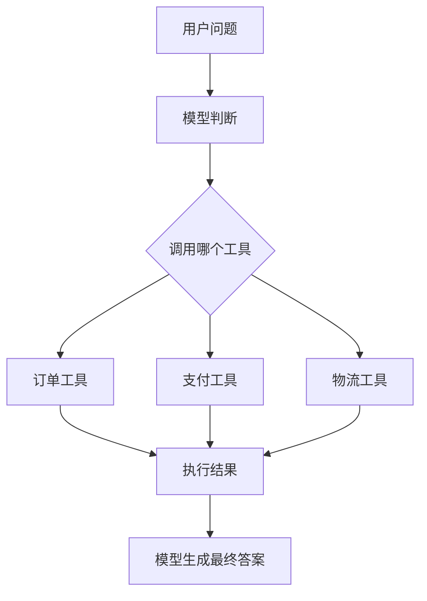

# 工具路由与执行

## 本章目标

这一章讨论多个工具同时存在时，模型如何选，系统如何执行，开发者如何控制。

---

## 工具路由图



---

## 简单执行注册表

```python
TOOLS = {
    "query_order_status": lambda order_id: {"order_id": order_id, "status": "paid"},
    "query_payment_status": lambda order_id: {"order_id": order_id, "payment": "success"},
}


def execute_tool(name: str, arguments: dict):
    if name not in TOOLS:
        raise ValueError(f"未知工具: {name}")
    return TOOLS[name](**arguments)
```

---

## 业务案例

### 客服分诊

先判断问题是订单、支付还是物流，再调用对应工具。

### 研发问题排查

根据日志类型调用错误码工具、部署工具或 FAQ 工具。

---

## 本章小结

多个工具存在时，系统要有路由、注册、执行和错误处理机制，不能只靠模型“自由发挥”。

---

## 下一章

最后还要处理一个关键问题：工具不能乱用：[工具安全与边界](./tool-safety)
