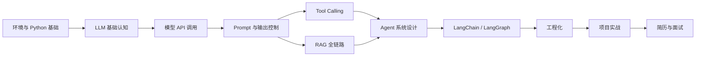
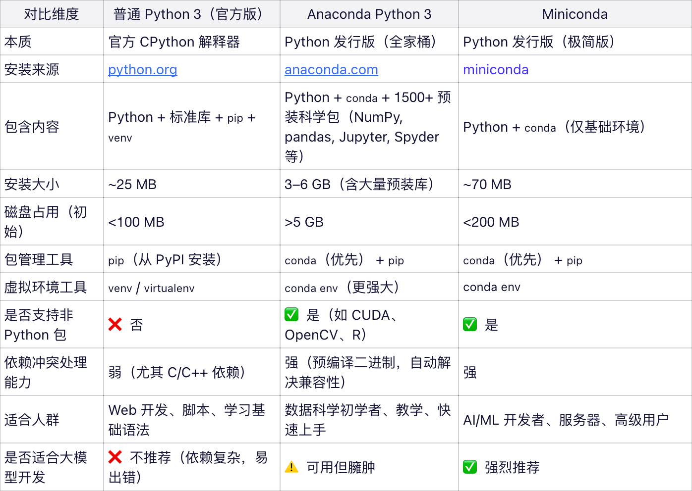

# 前言


## 学习顺序



## 环境



::: tip{title="提示"}
Miniconda 是 Anaconda 发行版的免费精简版，仅包含 conda、Python、它们各自依赖的软件包以及少量其他实用软件包（Miniconda 是 Anaconda 的“最小可行核心”，而 Anaconda = Miniconda + 预装的 1500+ 科学计算包 + 图形工具。）
:::


```shell
### Mac 安装
> brew search miniconda
==> Formulae
minica   minicom   minidlna

==> Casks
miniconda  minizincide
> brew install --cask miniconda
....
==> Caveats
Please run the following to setup your shell:
  conda init "$(basename "${SHELL}")"

Alternatively, manually add the following to your shell init:
  eval "$(conda "shell.$(basename "${SHELL}")" hook)"
....
# 修改你的 shell 配置文件（如 ~/.zshrc 或 ~/.bash_profile），添加 conda 的初始化脚本
> conda init "$(basename "${SHELL}")"
no change     /opt/homebrew/Caskroom/miniconda/base/condabin/conda
no change     /opt/homebrew/Caskroom/miniconda/base/bin/conda
no change     /opt/homebrew/Caskroom/miniconda/base/bin/conda-env
no change     /opt/homebrew/Caskroom/miniconda/base/bin/activate
no change     /opt/homebrew/Caskroom/miniconda/base/bin/deactivate
no change     /opt/homebrew/Caskroom/miniconda/base/etc/profile.d/conda.sh
no change     /opt/homebrew/Caskroom/miniconda/base/etc/fish/conf.d/conda.fish
no change     /opt/homebrew/Caskroom/miniconda/base/shell/condabin/Conda.psm1
modified      /opt/homebrew/Caskroom/miniconda/base/shell/condabin/conda-hook.ps1
no change     /opt/homebrew/Caskroom/miniconda/base/lib/python3.13/site-packages/xontrib/conda.xsh
no change     /opt/homebrew/Caskroom/miniconda/base/etc/profile.d/conda.csh
modified      /Users/fengwenshan/.zshrc

==> For changes to take effect, close and re-open your current shell. <==
> source ~/.zshrc   # 如果你用的是 zsh（macOS 默认）
# 或
> source ~/.bash_profile  # 如果你用的是 bash

> conda --version
conda 25.11.1
> python --version
Python 3.13.11
```


vscode配置

```jsonc
{
  "python.pythonPath": "/opt/homebrew/Caskroom/miniconda/base/bin/python",
  "python.defaultInterpreterPath": "/opt/homebrew/Caskroom/miniconda/base/bin/python"
}
```


```shell
# Windows 安装
PS C:\Users\a4244> winget search miniconda
名称       ID                  版本           匹配           源
--------------------------------------------------------------------
Miniconda  XP8BW2L1657681      Unknown                       msstore
Miniconda3 Anaconda.Miniconda3 py313_25.9.1-3 Tag: miniconda winget
```


2. Huggingface

大模型界的github, 先注册，然后添加token用来调用大模型


Hugging face 提供transformers库，用于加载和使用模型。
> pip install transformers torch openai python-dotenv requests sentence-transformers
> pip install faiss-cpu 
- transformers 是高层库，专注于提供预训练模型（如 BERT、GPT、T5 等）和 NLP 工具（tokenizer、pipeline 等）。
- torch 是底层框架，负责张量计算、自动求导、GPU 加速、神经网络模块等
- transformers 默认以 torch 为后端（也支持 TensorFlow 和 Flax，但 PyTorch 是最常用、更新最及时的）
- openai 可以调用模型
- python-dotenv 使用env 环境变量文件
- requests 发送接口请求    
- sentence-transformers 专门用于将文本编码为高质量的语义向量，支持语义相近似计算、信息检索、聚类等多种自然语言任务处理
- faiss-cpu  用于高效进行大规模向量相似性搜索的 Python 库，专为处理高维数值向量（如嵌入向量）而设计


## 模块安排


### 第一部分：基础篇


- 模块一：Prompt基础
    - [前言](/Prompt/module-1/chapter-0)
    - [大模型工作原理与Prompt的本质](/Prompt/module-1/chapter-1)
    - [Prompt设计原则：从清晰到结构](/Prompt/module-1/chapter-2)


### 第二部分：从Prompt到Agent——三大核心能力

- 模块二：让模型思考——推理增强技术
    - 第3章 思维链（CoT）深度剖析
    - 第4章 思维树（ToT）与图思维（GoT）
    - 第5章 自洽性（Self-Consistency）与高级推理技巧

- 模块三：让模型动手——工具调用能力
    - 第6章 Function Calling：原理与实践
    - 第7章 工具定义与多工具调度
    - 第8章 并行调用与复杂工具链

- 模块四：让模型知道——知识接入能力
    - 第9章 RAG基础：从检索到生成
    - 第10章 文档处理与向量化
    - 第11章 检索优化与混合检索

- 模块五：整合为Agent——推理、行动与知识的融合
    - 第12章 ReAct：推理与行动的协同
    - 第13章 Agent的规划与记忆
    - 第14章 多智能体系统：协作与竞争

### 第三部分：进阶篇

- 模块六：Prompt优化与自动化
    - 第15章 自动Prompt优化（APE & OPRO）
    - 第16章 Prompt评估与基准

- 模块七：高级检索技术
    - 第17章 HyDE、多路召回与重排序
    - 第18章 自适应检索与多跳检索

- 模块八：模型微调与Prompt的协同
    - 第19章 参数高效微调（LoRA、P-tuning）
    - 第20章 微调后的Prompt适配
    - 第21章 数据飞轮：Prompt收集数据微调


### 第四部分：生产篇

- 模块九：生产级LLM应用架构
    - 第22章 缓存与成本控制
    - 第23章 负载均衡与容错
    - 第24章 可观测性与LangSmith
    - 第25章 LangChain高级应用

- 模块十：安全、伦理与鲁棒性
    - 第26章 Prompt注入与防御
    - 第27章 偏见、公平性与毒性治理
    - 第28章 输出监控与红队测试

- 模块十一：多模态Prompt工程
    - 第29章 图像理解与视觉提示
    - 第30章 图文生成与交错输出
    - 第31章 视频与音频处理

### 第五部分：专题与实践

- 模块十二：领域专题实践
    - 第32章 代码生成与调试
    - 第33章 数据分析与可视化
    - 第34章 客服对话系统
    - 第35章 教育辅导与创意写作

- 模块十三：未来趋势与研究前沿
    - 第36章 AI Agent的演进
    - 第37章 测试时计算与自我纠错
    - 第38章 具身智能与Prompt的新形态

### 第六部分：综合实战

- 模块十四：大型项目实战
    - 第39章 智能客服助手（RAG + Function Calling）
    - 第40章 多智能体协作系统（AutoGen实战）
    - 第41章 端到端生产部署与监控


### 第七部分：前沿篇

- 模块十三：未来趋势与研究前沿
- 模块十四：综合实战