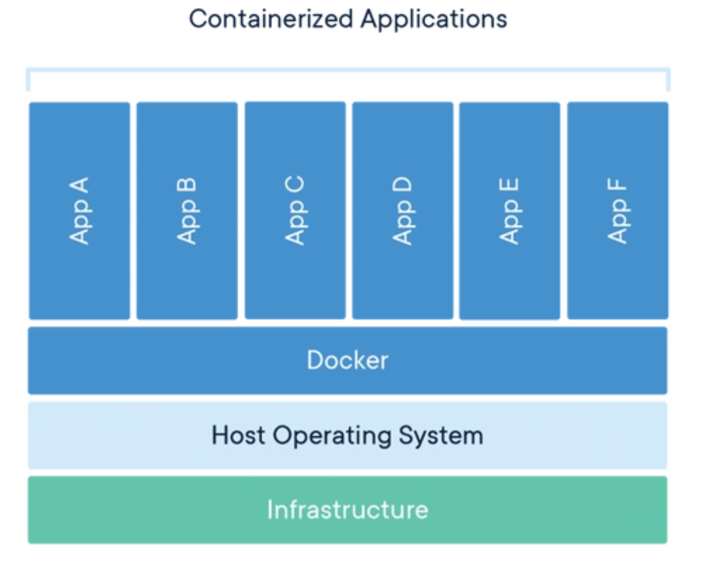
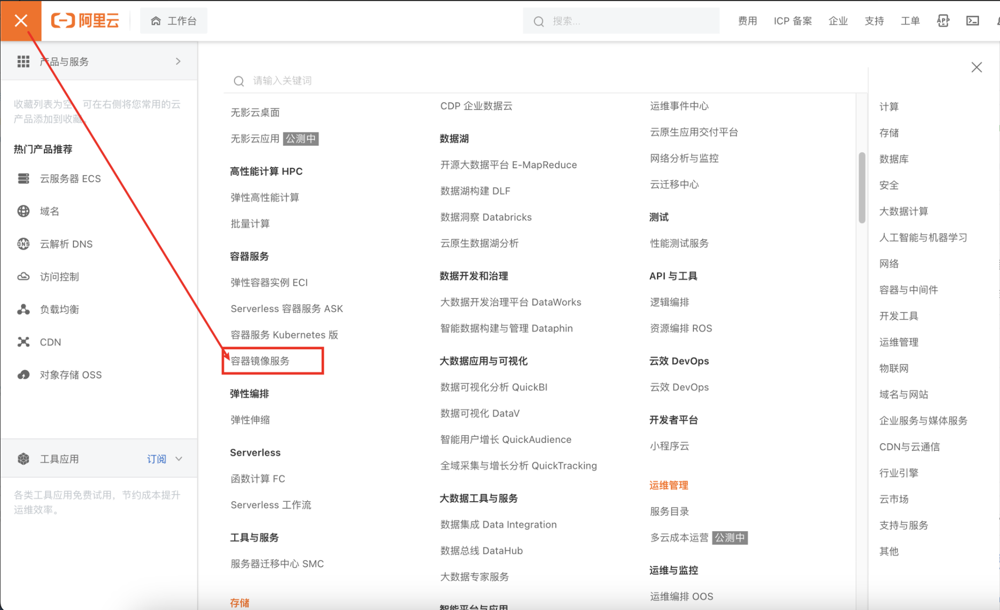
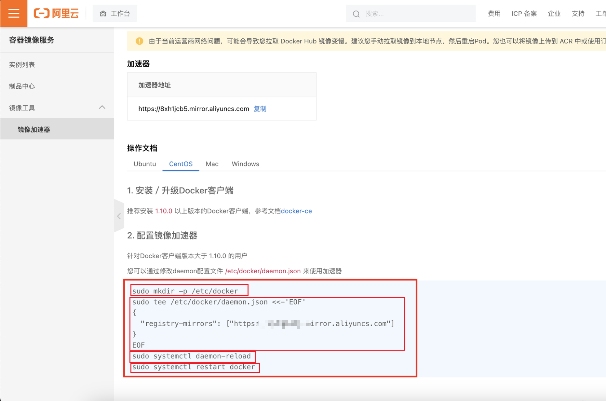

# 基础

## 介绍

Docker 是一个开源的应用容器引擎，可以轻松的为任何应用创建一个轻量级的、可移植的、自给自足的容器。开发者在本地编译测试通过的容器可以批量地在生产环境中部署，包括VMs（虚拟机）、bare metal、OpenStack 集群和其他的基础应用平台。

简单的说Docker类似集装箱，各种各样的货物，经过集装箱的标准化进行托管，而集装箱和集装箱之间是相互独立的没有影响的。也就是说，Docker平台就是一个软件集装箱的平台，也就是说可以自己构建应用程序，将其依赖关系一起打包到一个容器中，然后这些容器就很容易运行到其它机器上运行，而且非常方便装载、复制、移除。

Docker 容器是完全使用沙箱机制，相互之间不会有任何接口。这也是Docker称为容器的原因。



总而言之， Docker 是一个开放平台，使开发人员和管理员可以在称为容器的松散隔离的环境中构建镜像、交付和运行分布式应用程序。以便在开发、QA 和生产环境之间进行高效的应用程序生命周期管理。

## 镜像、容器、仓库

镜像（Image）是用于创建 Docker 容器的模板，镜像是只读的。相当于window的iso镜像

容器（Container）是镜像运行时的实体，是可运行的程序，是进程。容器相当于windows iso镜像进行安装成系统，这个系统就是容器

仓库（Repository）是集中存放镜像文件的场所，可以理解为代码控制中的代码仓库。仓库分为公有仓库和私有仓库，和github差不多，目前最大的就是官方Docker Hub


## docker与VM的区别


| 特性    | 容器      | 虚拟机           |
|:------|:--------|:--------------|
| 启动    | 快（秒）    | 慢（分钟）         |
| 空间    | MB      | GB            |
| 性能    | 接近原生    | 差距较大          |      
| 系统支持量 | 单机支持数不限 | 受限于主机的 CPU 核数 | 
| 隔离性   | 弱       | 强             |


## centOS安装

```shell
# 终端连接服务器
$ ssh 服务器用户@服务器ip地址
# 查看系统配置
$ cat /etc/os-release
# 退出 control + d
$ exit 
# 创建文件夹
$ mkdir fileDirName
# 创建文件
$ touch fileName.txt
# 编辑文件，没有就会创建
$ vi fileName.txt
# ---------- 开始docker安装之旅 -----------
# 官方文档： https://docs.docker.com/engine/install/centos/
	# 如果有旧版本先卸载旧版本。
		# 如果没有下面会报没有。
		# 有。卸载docker后，存储在/var/lib/doker/中的映像、容器、卷和网络不会自动删除。
$ sudo yum remove docker \
                  docker-client \
                  docker-client-latest \
                  docker-common \
                  docker-latest \
                  docker-latest-logrotate \
                  docker-logrotate \
                  docker-engine
# 需要的安装包
$ yum install -y yum-utils
# 设置镜像仓库, 最好用国内的阿里云地址
$ yum-config-manager --add-repo http://mirrors.aliyun.com/docker-ce/linux/centos/docker-ce.repo
# 这时候最好更新一下软件包的索引
$ yum makecache fast
# 安装docker最新版 docker-ce社区、 ee企业版
$ yum install docker-ce docker-ce-cli containerd.io docker-buildx-plugin docker-compose-plugin
# 查看版本信息，是否安装成功，这个命令和docker -v不同
$ docker version
# 这时候就安装完了，可以启动docker了
$ systemctl start docker
# 然后跑一个容器hello-world，详细信息见mac安装里面
$ docker run hello-world

# 查看镜像是否下载完成且运行
$ docker images
REPOSITORY    TAG       IMAGE ID       CREATED         SIZE
hello-world   latest    feb5d9fea6a5   18 months ago   13.3kB
```

安装后也能卸载

```shell
# 上面安装了什么东西就卸载掉就行: Docker Engine、CLI、containerd 和 Docker Compose 包
$ sudo yum remove docker-ce docker-ce-cli containerd.io docker-buildx-plugin docker-compose-plugin docker-ce-rootless-extras
# 主机上的图像、容器、卷或自定义配置文件不会自动删除。删除所有镜像、容器和卷
$ sudo rm -rf /var/lib/docker # docker工作目录
$ sudo rm -rf /var/lib/containerd
```

## 阿里云加速



依次执行下面四条命令，前面两条是新建并写入内容，后面两条是重启，启动



## 常用命令

```shell
# 启动docker 服务
$ systemctl start docker
# 停止docker 服务
$ systemctl stop docker
# 查看docker 服务状态
$ systemctl status docker
Unit cocker.service could not be found. # 如果没有这个服务，则需要安装
# 重启docker 服务
$ systemctl restart docker
[root@localhost ~]# docker ps 
# 如果报错，则说明没有启动
Cannot connect to the Docker daemon at unix:///var/run/docker.sock. Is the docker daemon running?
# 下载镜像
$ docker pull image_name:tag
# 列出镜像
$ docker images
# [下载并]启动镜像 
$ docker run image_name:tag
# 列出正在运行的容器
$ docker ps
# 列出所有容器
$ docker ps -a
# 列出所有容器
$ docker ls -a
# 启动容器
$ docker start [container_id]
# 停止容器
$ docker stop [container_id]
# 批量停止容器
$ docker container stop $(docker container ps -qa)
# 删除容器。 可以使用id hash的前面一两个字符就可以
$ docker rm id1 id2 id3 ... 
# 批量删除容器
  # 下面代码就是先执行 docker container ps -qa 取出所有正在运行容器的id, 然后再用 docker container rm 删除
$ docker container rm $(docker container ps -qa)
# 进入容器
$ docker exec -it [container_id] /bin/bash
# 退出容器
$ exit

# 列出所有镜像
$ docker images
# 删除镜像
$ docker rmi [image_id | image_name]

# 查看容器的进程
$ docker container top [container_id]　
# ppid 父进程id, pid 进程id, c 运行的进程数, s 运行时间, tty 终端, time 运行时间, cmd 命令
UID                 PID                 PPID                C                   STIME               TTY                 TIME                CMD
root                5336             　  5317                0                   19:34               ?                   00:00:00            nginx: master process nginx -g daemon off;　#　这个是nginx的master进程
101                 5386                5336                0                   19:34               ?                   00:00:00            nginx: worker process　#　这个是nginx的worker进程
101                 5387                5336                0                   19:34               ?                   00:00:00            nginx: worker process　
101                 5388                5336                0                   19:34               ?                   00:00:00            nginx: worker process
101                 5389                5336                0                   19:34               ?                   00:00:00            nginx: worker process
101                 5390                5336                0                   19:34               ?                   00:00:00            nginx: worker process
101                 5391                5336                0                   19:34               ?                   00:00:00            nginx: worker process
101                 5392                5336                0                   19:34               ?                   00:00:00            nginx: worker process
101                 5393                5336                0                   19:34               ?                   00:00:00            nginx: worker process

# linux 查看线程
$ ps -ef | grep nginx 
# 进程树显示进程关系，需要安装pstree。需要注意容器内和容器外的pid不一样
$ pstree -p 5336

```

## 安装容器


```shell
# 下载慢，去阿里云登录，控制台 -> 左上角菜单 -> 容器选项选择容器镜像服务ACR
# 如果有该镜像就会启动，没有的话下载nginx
$ docker container run nginx
[root@localhost ~]# docker container run nginx
Unable to find image 'nginx:latest' locally
latest: Pulling from library/nginx
a2abf6c4d29d: Pull complete 
a9edb18cadd1: Pull complete 
589b7251471a: Pull complete 
186b1aaa4aa6: Pull complete 
b4df32aa5a72: Pull complete 
a0bcbecc962e: Pull complete 
Digest: sha256:0d17b565c37bcbd895e9d92315a05c1c3c9a29f762b011a10c54a66cd53c9b31
Status: Downloaded newer image for nginx:latest
/docker-entrypoint.sh: /docker-entrypoint.d/ is not empty, will attempt to perform configuration
/docker-entrypoint.sh: Looking for shell scripts in /docker-entrypoint.d/
/docker-entrypoint.sh: Launching /docker-entrypoint.d/10-listen-on-ipv6-by-default.sh
10-listen-on-ipv6-by-default.sh: info: Getting the checksum of /etc/nginx/conf.d/default.conf
10-listen-on-ipv6-by-default.sh: info: Enabled listen on IPv6 in /etc/nginx/conf.d/default.conf
/docker-entrypoint.sh: Launching /docker-entrypoint.d/20-envsubst-on-templates.sh
/docker-entrypoint.sh: Launching /docker-entrypoint.d/30-tune-worker-processes.sh
/docker-entrypoint.sh: Configuration complete; ready for start up
2023/11/12 12:00:53 [notice] 1#1: using the "epoll" event method
2023/11/12 12:00:53 [notice] 1#1: nginx/1.21.5
2023/11/12 12:00:53 [notice] 1#1: built by gcc 10.2.1 20210110 (Debian 10.2.1-6) 
2023/11/12 12:00:53 [notice] 1#1: OS: Linux 3.10.0-1160.el7.x86_64
2023/11/12 12:00:53 [notice] 1#1: getrlimit(RLIMIT_NOFILE): 1048576:1048576
2023/11/12 12:00:53 [notice] 1#1: start worker processes
2023/11/12 12:00:53 [notice] 1#1: start worker process 32
2023/11/12 12:00:53 [notice] 1#1: start worker process 33
2023/11/12 12:00:53 [notice] 1#1: start worker process 34
2023/11/12 12:00:53 [notice] 1#1: start worker process 35
2023/11/12 12:00:53 [notice] 1#1: start worker process 36
2023/11/12 12:00:53 [notice] 1#1: start worker process 37
2023/11/12 12:00:53 [notice] 1#1: start worker process 38
2023/11/12 12:00:53 [notice] 1#1: start worker process 39
```

上面一个状态还在连接状态，开一个新的窗口，查看正在运行的容器

```shell
[root@localhost ~]# docker ps -a
CONTAINER ID   IMAGE     COMMAND                   CREATED         STATUS                     PORTS                                           NAMES
c7546dc1a354   nginx     "/docker-entrypoint.…"   3 minutes ago   Up 3 minutes               80/tcp                                          vibrant_mcnulty
```

## 容器模式

容器的attached和detached模式

- attached模式: 前台执行（不推荐）
- detached模式: 后台执行

```shell
# -d 后台运行容器 或 --detach
# 这样ctrl+c退出容器后，windows也会在后台运行, 但是unix内核的会停止容器，这也就是attached模式（windows不完整）
> docker container run -d nginx
[root@localhost ~]# docker container run -d nginx
56891379683535885585285238 # 这种不会挂起，而是在后台执行。
# 从detached模式切换到attached模式
> docker container attach 56
# 在detached模式下，查看容器的日期
[root@localhost ~]# docker container logs 5689
# 动态跟踪log
[root@localhost ~]# docker container logs -f 5689
```

```shell
# -p 把容器内的80端口映射到主机上80端口
> docker container run -p 80:80 nginx 
[root@localhost ~]# docker container run -p 80:80 nginx
/docker-entrypoint.sh: /docker-entrypoint.d/ is not empty, will attempt to perform configuration
/docker-entrypoint.sh: Looking for shell scripts in /docker-entrypoint.d/
/docker-entrypoint.sh: Launching /docker-entrypoint.d/10-listen-on-ipv6-by-default.sh
10-listen-on-ipv6-by-default.sh: info: Getting the checksum of /etc/nginx/conf.d/default.conf
10-listen-on-ipv6-by-default.sh: info: Enabled listen on IPv6 in /etc/nginx/conf.d/default.conf
/docker-entrypoint.sh: Launching /docker-entrypoint.d/20-envsubst-on-templates.sh
/docker-entrypoint.sh: Launching /docker-entrypoint.d/30-tune-worker-processes.sh
# 执行/docker-entrypoint.sh 脚本启动nginx
/docker-entrypoint.sh: Configuration complete; ready for start up 
2023/11/12 12:24:11 [notice] 1#1: using the "epoll" event method
2023/11/12 12:24:11 [notice] 1#1: nginx/1.21.5
2023/11/12 12:24:11 [notice] 1#1: built by gcc 10.2.1 20210110 (Debian 10.2.1-6) 
2023/11/12 12:24:11 [notice] 1#1: OS: Linux 3.10.0-1160.el7.x86_64
2023/11/12 12:24:11 [notice] 1#1: getrlimit(RLIMIT_NOFILE): 1048576:1048576
2023/11/12 12:24:11 [notice] 1#1: start worker processes
2023/11/12 12:24:11 [notice] 1#1: start worker process 31
2023/11/12 12:24:11 [notice] 1#1: start worker process 32
2023/11/12 12:24:11 [notice] 1#1: start worker process 33
2023/11/12 12:24:11 [notice] 1#1: start worker process 34
2023/11/12 12:24:11 [notice] 1#1: start worker process 35
2023/11/12 12:24:11 [notice] 1#1: start worker process 36
2023/11/12 12:24:11 [notice] 1#1: start worker process 37
2023/11/12 12:24:11 [notice] 1#1: start worker process 38
```

我是使用虚拟机，在虚拟机中安装docker, 虚拟机地址是：`http://192.168.3.33/`, 然后我用物理主机访问该地址就行，就可以访问到nginx欢迎首页。

然后在上面shell 启动等待窗口中，有访问记录出现

```shell
192.168.3.31 - - [12/Nov/2023:12:26:47 +0000] "GET / HTTP/1.1" 200 615 "-" "Mozilla/5.0 (Windows NT 10.0; Win64; x64) AppleWebKit/537.36 (KHTML, like Gecko) Chrome/119.0.0.0 Safari/537.36" "-"
192.168.3.31 - - [12/Nov/2023:12:26:47 +0000] "GET /favicon.ico HTTP/1.1" 404 555 "http://192.168.3.33/" "Mozilla/5.0 (Windows NT 10.0; Win64; x64) AppleWebKit/537.36 (KHTML, like Gecko) Chrome/119.0.0.0 Safari/537.36" "-"
2023/11/12 12:26:47 [error] 32#32: *1 open() "/usr/share/nginx/html/favicon.ico" failed (2: No such file or directory), client: 192.168.3.31, server: localhost, request: "GET /favicon.ico HTTP/1.1", host: "192.168.3.33", referrer: "http://192.168.3.33/"
```

## 容器交互

- `-it`: 进入容器进行shell交互
- `exec`: 进入容器执行命令
- `exit`: 退出交互模式，这样容器也会停止
- `docker exec -it 56 /bin/bash` 交互式进入容器


```shell
# 进入容器
> docker container exec -it 56 /bin/bash
[root@localhost ~]# docker container exec -it 56 /bin/bash
root@56891379683535885585285238:/# # 进入容器后，可以执行命令
root@56891379683535885585285238:/# # 退出容器
root@56891379683535885585285238:/# exit
exit
```

## docker run


`docker container run -d --publish 80:80 --name nginx_1 nginx`: 

- 在本地查找是否有有nginx镜像，没有就从docker hub下载
- 启动一个新的容器，并把容器的80端口映射到主机的80端口,容器名为nginx_1
- 基于nginx镜像启动一个新的容器
- docker engine分配给这个容器一个虚拟ip地址
- 容器启动后，会在容器内执行/docker-entrypoint.sh 脚本，启动nginx


