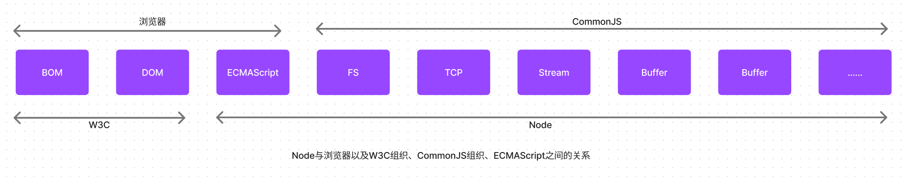
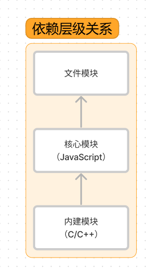
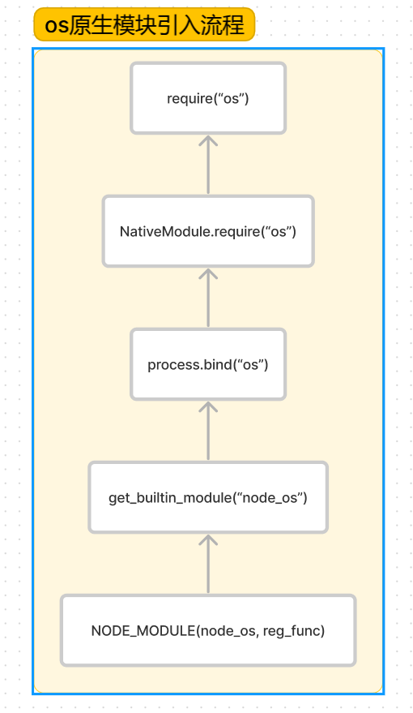
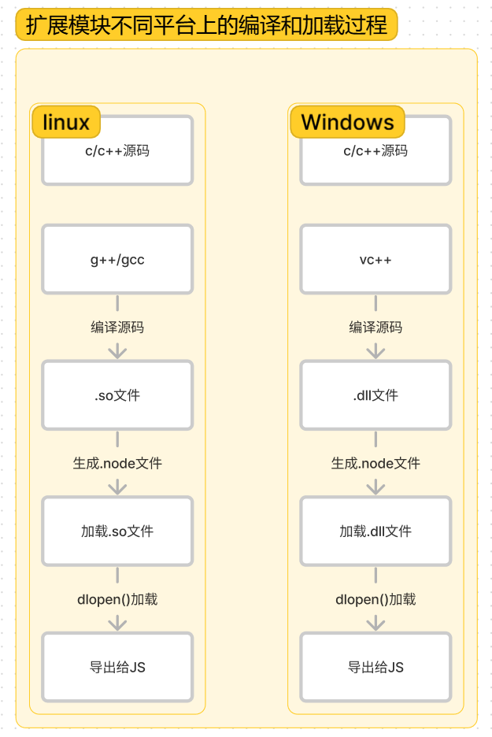

# CommonJS

## CommonJS模块规范

CommonJS规范起初是弥补JS语言模块的缺陷，它是语言层面的规范，定义分为引入、定义、标识符三个部分。

CommonJS中的大部分规范虽然依旧是草案，但是已经出显成效，为JavaScript开发大型应用程序指明了一条非常好的道路。目前，依旧在成长中，这些规范涵盖了模块、二进制、Buffer、字符集编码、I/O流、进程环境、文件系统、套接字、单元测试、web服务器网关接口、包管理器等。

理论和时间总是相互影响和促进的，Node能以一种比较程度的姿态出现，离不开CommonJS规范的影响。在服务器端，CommonJS能以一种寻常姿态写进各个公司的项目代码中离不开node优异表现。实现的优良表现离不开规范最初优秀的设计，规范因实现的推广而普及。node与浏览器以及w3c组织、CommonJS组织、ECMAScript之间的关系，共同构成了一个生态系统。



Node借鉴CommonJS的Modules规范实现了一套易用的模块系统，NPM对Packages规范的支持使得Node应用在开发过程中事半功倍。

CommonJS对模块的定义十分简单，主要分为模块引用、模块定义和模块标识三个部分：

```javascript
// 模块引用
const path = require('node:path')

// 模块定义
exports.path = path
```

在CommonJS规范中，存在require()方法，这个方法接受模块标识，以此引入一个模块的API。

在模块中，上下文提供require()方法来引入外部模块。对应引入的功能，上下文提供了exports对象用于导出当前模块的方法和变量，并且它是唯一导出的出口。在模块中还存在一个module对象，它代表模块本身，而exports是module的属性。

在Node中，一个文件就是一个模块，将方法挂载在exports对象上作为属性即可定义导出方式

```javascript
const sum = (a, b) => {
  return a + b
}
exports.sum = sum
```

模块标识就是传递给require()方法的参数，它必须是符合小驼峰命名的字符串，或者以.、..开头的相对路径，或者绝对路径。它可以没有文件名的后缀.js

Module在任意模块中可直接使用包含模块信息。

Require接收标识符，加载目标模块。

Exports与module.exports都能导出模块

## node 的模块实现

Node实现中并非完全按照规范实现，而是对模块规范进行一定的取舍，同时也增加了少许自身需要的特性。景观规范中exports、require和module听起来十分简单，但是node在实现它们的过程中经历了什么，这个过程需要知晓。

在Node中引入模块，需要经历三个步骤：

1. 路径分析
2. 文件定位
3. 编译执行

在node中，模块分为两类：一类是Node提供的模块，称为核心模块；另一类是用户编写的模块，称为文件模块。

- 核心模块部分在Node源代码的编译过程中，编译进了二进制执行文件。在Node进程启动时，部分莫核心模块就被直接加载进内存中，所以这部分核心模块引入时，文件定位和编译执行这两个步骤可以直接省略，并且在路径分析中优先判断，所以它的加载速度是最快的。
- 文件模块则是在运行时动态加载，需要完整的路径分析、文件定位、模块编译执行过程，速度比核心模块慢。


### 模块加载

前端浏览器会魂村静态脚本文件以提高性能一样，Node对引入郭的模块都会进行缓存，以减少二次引入时的开销。不同的地方在于，浏览器仅仅缓存文件，而node缓存的是编译和执行后的对象。

无论是核心模块还是文件模块，require()方法对想同模块的二次加载都在一律采用缓存优先的方式，这是第一优先级。不同之处在于核心模块的缓存检查先于文件模块的缓存检查。


### 路径分析

因为标识符有几种形式，对于不同的标识符，模块的查找和定位有不同程序上的差异。

require()方法接收一个标识符作为参数。在node实现中，正是基于这样一个标识符进行模块查找的。模块标识符在node中主要分为以下几类：

- 核心模块。如http、fs、path模块。
- .或..开始的相对路径文件模块。
- 以/开始的绝对路径文件模块。
- 非路径形式的文件模块，如自定义的connect模块。

核心模块的优先级仅次于缓存加载，它在node的源代码编译过程中已经编译为二进制代码，其加载过程最快。如果试图加载一个与核心模块标识符想同的自定义模块，不会成功的。如果自己编写的http用户模块，想要加载成功，必须选择一个不同的标识符或换用路径方式。

以.或..和/开始的标识符，这里都被当成文件模块来处理。在分析文件模块时，require()方法会将路径转为真实路径，并以真实路径作为索引，将编译执行后的结果存放在缓存中，以使二次加载时更快。 由于文件模块给node指明文件位置，所以在查找过程中可以节约大量时间，其加载速度仅次于核心模块。

自定义模块指非核心模块，也不是路径形式的标识符。它是一种特殊的文件模块，可能是一个文件或包的形式。这类模块的查找最费时，也是所有方式中最慢的一种。


模块路径是node在定位文件模块的具体文件时制定的查找策略，具体表现为一个路径组成的数组。

1. 创建module_path.js文件，其内容`console.log(module.path)`
2. 将其放在任意一个目录中然后执行node module_path.js

在linux下可能得到这样的一个数组输出

```shell
[
  '/home/jackson/research/node_modules',
  '/home/jackson/node_modules',
  '/home/node_modules',
  '/node_modules',
]
```

windows下，也许是这样

```shell
['c\\nodejs\\node_modules', 'c:\\node_modules']
```

可以看出，模块路径的生成规则如下所示：

- 当前文件目录下的node_modules目录
- 父目录下的node_modules目录
- 父目录下的node_modules目录
- 沿路径向上逐级递归，知道根目录下的node_modules目录

它的生成方式与JS的原型链或作用域链查找方式十分类似。在加载的过程中，node会逐个尝试模块路径中的路径，知道找到目标文件位置。可以看出，当前文件的路径越深，模块查找耗时会越多，这是自定义模块的加载速度最慢的原因。


### 文件定位

从缓存加载的优化策略使得二次引入时不需要路径分析、文件定位和编译执行过程，大大提高了再次加载模块时的效率。

但在文件的定位过程中，还有一些细节需要注意，这主要包括文件扩展名的分析、目录和包处理。

- 文件扩展名分析

require()分析标识符的过程中，会出现标识符中不包含文件扩展名的情况。CommonJS模块规范也许在标识符中不包含文件扩展名，这种情况下，Node也会按`.js`、`.json`、`.node`的次序补足扩展名，依次尝试。

在尝试过程中，需要调用fs模块同步阻塞式地判断文件是否存在。因为node是单线程的，所以这里是一个会引起性能问题的地方。如果是.node或.json文件，在传递给require()的标识符中带上扩展名，会加快一点速度。另外一个诀窍就是同步配合缓存，可以大幅度缓解node单线程中阻塞式调用的缺陷。

- 目录分析和包

在分析标识符的过程中，require()通过分析文件扩展名之后，可能没有查找到对应文件，但却得到一个目录，这里引入自定义模块和逐个模块进行查找时经常会出现，此时node会将目录当成一个包来处理。

在这个过程中，node对commonjs包规范进行了一定程度的支持。首先，node在调用目录下查找package.json（CommonJS包规范定义的包描述文件），通过JSON.parse()解析出包描述对象，从中取出main属性指定的文件名进行定位。如果文件名缺少扩展，将会进入扩展名分析的步骤。

而如果main属性指定的文件名称错误，或者就没有package.json文件，node会将index当做默认问及那么，然后依次查找index.js、index.json、index.node。

如果在目录分析过程中没有定位成功任何文件，则自定义模块进入下一个模块路径进行查找。如果模块路径数组都被遍历完成，依然没有查找到目录文件，则会抛出查找失败的异常。

### require属性

- 基本功能是读入并且执行一个模块文件
- resolve 返回模块文件绝对路径
- extensions 依据不同后缀名执行解析操作
- main 返回主模块对象

## 模块编译

在node中，每个文件模块都是一个对象，它的定义如下：

```javascript
function Module(id, parent) {
  this.id = id // 返回模块标识符，一般是一个绝对路径
  this.paths = [] // 存放不同目录下的node_modules位置
  this.exports = {} // 返回当前模块需要暴露的内容
  this.parent = parent // 返回对象存放调用当前模块的模块
  parent?.children?.push(this) 
  this.filename = null // 返回文件模块的绝对路径
  this.loaded = false // 返回bool,表示模块是否完成加载
  this.children = [] // 存放当前模块调用的其他模块
}
```

编译和执行时引入文件模块的最后一个阶段。定位到具体的文件后，node会新建一个模块对象，然后根据路径载入并编译。对不同的文件扩展名，其载入方法也有不同，具体如下所示。

- .js文件。通过fs模块同步读取文件后编译执行。
- .node文件。这是c/c++编写的扩展文件，通过dlopen方法加载最后编译生成的文件。
- .json文件。通过fs模块同步读取文件后，用JSON.parse解析返回结果。
- 其余扩展名文件。它们都被当做.js文件载入

每一个编译成功的模块都会将其文件路径作为索引缓存的Module._cache对象上，以提高二次引入的性能。

根据不同的文件扩展名，node会调用不同的读取方式，如.json文件的调用如下：

```javascript
Module.extensions['.json'] = function(module, filename) {
  const content = NativeModule.require('fs').readFileSync(filename, 'utf8');
  try {
    module.exports = JSON.parse(stripBOM(content))
  } catch (err) {
    err.message = filename + ': ' + err.message;
    throw err;
  }
}
```

其中Module._extensions会被赋值给require()的extensions属性，所以通过在代码中访问require.extensions可以知道系统中已有的扩展加载方式。编写如下测试一下：

```javascript
console.log(require.extensions)
```

得到的结果如下

```shell
{ '.js': [Function], '.json': [Function], '.node': [Function] }
```

如果想对自定义的扩展名进行特殊的加载，可以通过类似`require.extension['ext']`的方式实现。早期的CoffeeScript文件就是通过添加`require.extensions['.coffee']`的扩展方式来实现加载的。但是从v0.10.6版本开始，官方不鼓励通过这种方式来进行自定义扩展名的加载，而是期望先将其它语言或文件编译成JS文件后再加载，这样做的好处在于不将繁琐的编译加载等过程引入node执行过程中。在确认文件扩展名之后，node将调用具体的编译方式来将文件执行后返回给调用者。


### JS模块的编译

CommonJS模块规范，每个模块文件中存在`require`、`exports`、`module`这3个变量，但是他们在模块文件中没有定义，那么它们存在哪。还有`__filename`、`__dirname`这两个变量的存在，它们从何而来。如果放在全局变量，那么就会存在变量污染情况。

事实上，在编译过程中，node对获取的JS文件内容进行头尾包装。


```javascript
(function (exports, require, module, __filename, __dirname) {
  const math = require('math')
  exports.area = function(radius) {
    return Math.PI * raduis * raduis
  }
})()
```

这样么个模块文件之间都进行了作用域隔离。包装之后的代码会通过vm原生模块的runInThisContext()方法执行（类似eval, 只是具有明确上下文，不污染全局作用域），返回一个具体的Function对象。最后，将当前模块对象的exports属性、require()方法、module(模块对象自身)、以及在文件定位中得到的完整文件路径和文件目录作为参数传递给这个function()执行。

这就是这些变量并没有定义在每个模块文件中存在的原因。在执行之后，模块的exports属性被返回给了调用方。exports属性上的任何方法和属性都可以被外部调用到，但是模块中的其余变量或属性则不可直接调用。


### C/C++模块的编译

Node调用process.dlopen()方法进行加载和执行。在Node架构下，dlopen()方法在windows和linux平台下分别有不同的实现，通过libuv进行了封装。

实际上，.node的模块文件并不需要编译，因为它是编写c/c++模块之后编译生产的，所以这里只有加载和执行过程。在执行的过程中，模块的exports对象与.node模块产生联系，然后返回给调用者。

c/c++模块给node使用者带来的优势主要是执行效率方法，劣势则是c/c++模块的编写门槛比JS高。


### JSON文件的编译

.json文件的编译是3中编译方式中最简单的。node利用fs模块同步读取json文件的内容之后，调用JSON.parse()方法得到对象，然后将它赋予给模块对象的exports,以供外部调用。

JSON文件在用作项目的配置文件时比较有用。如果定义了一个JSON文件作为配置，那就不必调用fs模块去异步读取和解析，直接调用require引入即可。此外，可以享受到模块缓存便利，并且二次引入时也没有性能影响。

这里提到的模块编译都是指文件模块，即用户自己编写的模块。

## 核心模块

node核心模块在编译成可执行文件的过程中被编译成二进制文件。核心模块其实分为c/c++编写和JS编写的两部分，其中c/c++编写存放在node项目的src目录下，js文件存放在lib目录下。

### JS核心模块的编译过程

在编译所有c/c++文件之前，编译程序需要将所有的JS模块文件编译成c/c++代码，此时是否直接将其编译为可执行代码？ 其实不是

1. 转存为c/c++代码

node采用v8附带的js2e.py工具，将所有内置的js代码转换成c++里的数组，生成node_natives.h头文件。

在这个过程中，js代码以字符串的形式存储在node命名空间，是不可直接执行的。在启动node进程时，js代码直接加载进内存中。在加载的过程中，js核心模块经历标识符分析后直接定位到内存中，比普通文件模块从磁盘中一处一处查找要快的多。


2. 编译js核心模块

lib目录下的所有模块文件也没有定义require、module、exports这些变量。在引入JS核心模块过程中，也经历了头尾包装过程，然后才执行和导出exports独享。与文件模块有区别的地方在于：获取源代码的方式（核心模块是从内存中加载的）以及缓存执行结果的位置。

JS核心模块的定义如下面的代码所示，源文件通过process.binding('natives')取出，编译成功的模块缓存到NativeModule._cache对象上，文件模块则缓存到Module._cache对象上：

```javascript
function NativeModule(id) {
  this.filename = id + '.js';
  this.id = id;
  this.exports = {};
  this.loaded = false;
}
NativeModule._source = process.binding('natives');
NativeModule._cache = {};
```


### C/C++核心模块的编译过程

在核心模块中，有些模块全部由c/c++编写，有些模块则由c/c++完成核心部分，其他部分则由JS实现包装或向外导出，以满足性能需求。后面这种c/c++模块主内完成核心，js主外实现封装模式是node能够提高性能的常见方式。通常，脚本语言的开发速度优于静态语言，但是其性能则弱于静态语言。而node的这种复合模式可以在开发速度和性能之间找到平衡点。

我们一般哪些由c/c++编写的部分统称内建模块，因为它们通常不被用户直接调用。node的buffer、crypto、evals、fs、os等模块都是部分通过c/c++编写的。

1. 内建模块的组织形式

在node中，内建模块的内部结构定义如下：


```cpp
struct node_module_struct {
  int version;
  void *dso_handle;
  const char *filename;
  void (*register_func) (v8::Handle<v8::Object> target)
  const char *modname
}
```

每一个内建模块在定义之后，都通过NODE_MODULE宏将模块定义到node命名空间中，模块的具体初始化方法挂载为结构的register_func成员：

```cpp
#define NODE_MODULE(modname, regfuns)                                 \
  extern "C" {                                                        \
    NODE_MODULE_EXPORT node::node_module_struct modname ## _module =  \
    {                                                                 \
      NODE_STANDARD_MODULE_STUFF,                                     \
      regfunc,                                                        \
      NODE_STRINGIFY(modname)                                         \
    };                                                                \
  }
```

node_extensions.h文件将这些散列的内建模块统一放进一个叫node_module_list的数组中，这些模块有： node_buffer、node_crypto、node_evals、node_fs、node_http_parser、node_os、node_zlib、node_timer_wrap、node_tcp_wrap、node_udp_wrap、node_pipe、node_cares_wrap、node_tty_wrap、node_process_wrap、node_fs_event_wrap、node_signal_watcher。

这些内建模块的取出也十分简单。node提供get_builtin_module()方法从node_module_list数组中取出这些模块。

内建模块的优势在于：首先，它们本身由c/c++编写，性能上优于脚本语言；其次，在进行文件编译时，它们被编译进二进制文件。一旦node开始执行，它们被直接加载进内存中，无须再次做标识符定位、文件定位、编译等过程，可以直接执行。

2. 内建模块的导出

在node的所有模块类型中看，存在一种依赖层级关系，即文件模块可能会依赖核心模块，核心模块可能依赖内建模块。



通常，不推荐文件模块直接调用内建模块。如需调用，直接调用核心模块即可，因为核心模块中基本封装了内建模块。那么内建模块是如何将内部变量或方法导出，以供外部JS核心模块调用的呢？

node在启动时，会生成一个全局变量process，并提供Binding()方法来协助加载内建模块。

```cpp
static Handle<Value> Binding(const Arguments& args) {
    HandleScope scope;
    Local<String> module = args[0]->ToString();
    String::Utf8Value module_v(module);
    node_module_struct*modp;
    if(binding_cache.IsEmpty()) {
        binding_cache = persistent<Object>::New(Object::New());
    }
    Local<Object> exports;
    if(binding_cache->Has(module)) {
        exports = binding_cache->Get(module)->ToObject();
        return scope.Close(exports)
    }

    // Append a string to process.moduleLoadList
    char buf[1024];
    snprintf(buf, 1024, "binding %s", *module_v)
    uint32_t l = module_load_list->Length();
    module_load_list->Set(l, String::New(buf))

    if((modp = get_builtin_module(*module_v)) != NULL) {
        exports = Object::New()
        modp->register_func(exports)
        binding_cache->Set(module, exports)
    } else if(!strcmp(*module_v, "constants")) {
        exports= Object::New();
        DefineConstants(exports);
        binding_cache->Set(module, exports);
        #ifdef __POSIX__
    }  else if(!strcmp(*module_v, "io_watcher")) {
        exports = Object::New();
        IOWatcher::Initialize(exports);
        binding_cache->Set(module, exports);
        #endif
    } else if(!strcmp(*module_v, "natives")) {
        export = Object::New();
        DefineJavaScript(exports);
        binding_cache->Set(module, exports);
    } else {
        return ThrowException(Exception::Error(String::New("No such module")));
    }
    return scope.Close(exports);
}
```

在加载内建模块时，先创建一个exports空对象，然后调用get_builtin_module()方法取出内建模块对象，通过register_func()填充exports度下你给，最后将exports对象按模块名称缓存并返回给调用方完成导出。

这个方法不仅可以导出内建方法，还能导出一些别的内容。js核心文件被转换为c/c++数组存储后，便通过process.binding('native')取出防止在NativeModule._source中的：`NativeModule._source = process.binding('natives')`

该方法将通过js2c.py工具转换出的字符串数组取出，然后重新转换为普通字符串，以对JS核心模块进行编译和执行。


### 核心模块的引入流程 

前面讲述核心模块的原理，也结识了核心模块的引入速度为何最快。下图os原生模块的引入流程可以看到，为了符合CommonJS规范，从JS到c/c++的过程是相当复杂，要经历c/c++层面的内建模块定义、JS核心模块的定义和引入以及JS文件模块层面引入。但对用户来说，require()十分简洁、友好




### 编写核心模块

核心模块被编译进二进制文件需要遵循一定规则。作为node使用者，尽管机会没有机会参与核心模块的开发，但是了解如何开发核心模块有助于更深入了解node.

核心模块中js部分几乎与文件模块的开发想通，遵循CommonJS模块规范，上下文中除了拥有require、module、exports外，还可以调用Node中的一些全局变量。

下面以c/c++模块为例掩饰如何编写内建模块。为了便于理解，先编写一个js版本的原型，这个方法返回一个`Hello world！`字符串

```javascript
exports.sayHello = function() {
    return 'Hello world！'
}
```

编写内建模块通常分两步完成：编写头文件和编写c/c++文件。

1. 将一下代码保存为node_hello.h, 存放在node的src目录下

```cpp
#ifndef NODE_HELLO_H_
#define NODE_HELLO_H_
#include <v8.h>

namespace node {
  // 预定义方法
  v8::Handle<v8::Value> SayHello(const v8::Arguments& args); 
}
#endif
```

2. 编写node_hello.cc, 并存储到src目录下

```cpp
#include <node.h>
#include <node_hello.h>
#include <v8.h>
namespace node {
  using namespace v8;
  // 实现预定义的方法
  Handle<Value> SayHello(const Arguments& args) {
    HandleScope scope;
    return scope.Close(String::New("Hello world！"));
  }
  
  // 给传入的目标对象添加sayHello方法
  void Init_Hello(Handle<Object> target) {
    target->Set(String::NewSymbol("sayHello), FunctionTemplate::New(SayHello)->GetFunction());
  }
}
// 调用NODE_MODULE() 将注册方法定义到内存中
NODE_MODULE(node_hello, node::Init_hello);
```


以上两步完成了内建模块的编写，但是真正要让node认为它是内建模块，还需要更改src/node_extensions.h,在NODE_EXT_LIST_END前添加NODE_EXT_LIST_ITEM(node_hello),以将node_hello模块添加进node_module_list数组中。

其次，还需要让编写的两份代码编译进执行文件，同时需要更改node项目生产文件node.gyp，并在'target_name': 'node'节点的sources中添加上新编写的两个文件。然后编译整个node项目。

编译和安装后，直接在命令行中运行一下代码，将会得到期望的效果：

```shell
$ node
> var hello = process.binding('hello');
undefined
> hello.sayhello()
'hello world！'
```

[可以参考这个地址](https://github.com/JacksonTian/diveintonode_examples/tree/master/02/addon)


## C/C++扩展模块

JS的一个典型弱点就是位运算。JS的位运算参照Java的位运算实现，但是Java位运算是在Int型数字的基础上进行的，而JavaScript中只有double型的数据类型，在进行位运算的过程中，需要将double型转换为int型，然后再进行。所以，在JS层面上做位运算的效率不高。


在应用中，会频繁出现位运算的需求，包括转码，编码等过程，如果通过JS来实现CPU资源将会耗费很多，这时编写c/c++扩展模块来提升性能。

c/c++扩展模块属于文件模块中的一类。c/c++模块通过预先编译为.node文件，然后调用process.dlopen()方法加载执行。那么将分析整个c/c++扩展模块的编写、编译、加载、导出的过程。

注意：node原生模块时跨平台的，前提条件源代码可以支持在linux和window上编译，其中linux下通过g++/gcc等编译器编译为动态链接共享对象文件(.so)，在windows下则需要通过visual c++编译器编译为动态链接库文件（.dll）。在引入加载时是.node文件。因为.node扩展名只是为了看起来自然，不会以为平台差异产生不同的感觉。实际上，在window下它是.dll文件，在linux下是.os文件。为了实现跨平台，dlopen()方法内部实现时区分了平台，分别用的是加载.dll与.so方式。一个平台下的.node文件在另一个平台下是无法加载执行的，必须重新用各自平台下的编译器编译为正确的.node文件。



如果想要编写高质量的c/c++扩展模块，还需要身后的c/c++编程功底才行。除此之外，以下这些条目都是不能避开的，在了解它们之后，可以在编写时事半功倍。

- **GYP项目生成工具**  在node0.6中，第三方模块通过自身提供的node_waf工具实现编译。但是它是linux平台下的产物，无法实现跨平台编译。在node 0.8中，node决定抛弃掉node_waf而采用跨平台效果更好的项目生成器GYP工具（Generate Your Projects）。它的好处在于，可以帮助你生成各个平台下的项目文件，比如Windows下的Visual Studio解决方案文件（.sln）、Mac下的XCode项目配置文件以及Scons工具。在这个基础上，再动用各自平台下的编译器编译项目。这大大减少了跨平台模块在项目组织上的精力投入。
<br/>Node源码中一度出现过各种项目文件，后来均统一为gyp工具。这除了可以减少编写跨平台项目文件的工作量外，另外一个简单原因就是node自身的源码就是通过gyp编译的。为此，Nathan Rajlich基于GYP为node提供了一个专有的扩展构建工具node-gyp,这个工具通过`npm install -g node-gyp`命令即可安装。

- **V8引擎c++库** V8是node自身的动力来源之一。它自身由c++完成，可以实现js与c++的互相调用
- **libuv库** 它是node自身动力来源之二。node能够实现跨平台的一个诀窍就是它的libuv库，这个库就是跨平台的一层封装，通过它去调用一些底层操作，比自己在各个平台下编写实现要高效的多。libuv封装的功能包括事件循环、文件操作系统等。
- **node内部库** 写C++模块时，免不了要做一些面向对象的编程工作，而node自身提供了一些c++代码，比如node::ObjectWrap类可以用来包装你的自定义类，它可以帮助实现对象回收等工作。
- **其他库** 其他存在deps目录下的库在编写扩展模块时也许可以帮助你，比如zlib、openssl、http_parser等


**c/c++扩展模块编写**

上面介绍过c/c++内建模块时，已经介绍了c/c++模块编写方式。普通模块与内建模块的区别在于无需将源代码编译进node,而是通过dlopen()方法动态加载。所以在编写普通扩展模块时，无需将源代码写进node命名空间，也不需要提供头文件。下面我们将采用同一种例子来介绍c/c++扩展模块的编写。

```cpp
// js原型代码与上面的例子一样
// exports.sayHello = function() { return 'hello world！' }

// 新建hello目录作为自己的项目位置，编写hello.cc并将其存储到src目录下
#include <node.h>
#include <v8.h>

using namespace v8;

// 实现预定义方法
Handle<Value> Sayhello(const Argument& args) {
  HandleScope scope;
  return scope.Close(String::New("hello world！"))
}


// 给传入的目标对象添加sayHello方法
void Init_Hello(Handle<Object> target) {
    target->Set(String::NewSymbol("sayHello), FunctionTemplate::New(SayHello)->GetFunction());
}
// 调用NODE_MODULE() 将注册方法定义到内存中
NODE_MODULE(node_hello, node::Init_hello);
```

c/c++扩展模块与内建模块的套路一样，将方法挂载在target对象上，然后通过NODE_MODULE声明即可。

由于不像编写内建模块声明到node_module_list链表中，所以无法被被认作是一个原生模块，只能通过dlopen()来动态加载，然后到处给JS调用。


**扩展模块编译**

在GYP工具帮助下，c/c++扩展模块的编译是一件省心的事情，无需为每个平台编写不同的项目编译文件。写好.gyp项目文件时除编码外的头等大事，node-gyp约定.gyp文件为binding.gyp,内容如下：

```gyp
{
  'target': [
    {
      'target_name': 'hello',
      'sources': [ 'src/hello.cc' ],
      'conditions': [
        [ 
          'OS == "win"',
          {
            'libraries': ['-Lnode.lib']
          }
        ]
      ]
    }
  ]
}
```

然后调用： `node-gyp configure`。node-gyp configure这个命令会在当前目录中创建build目录，并生成系统相关项目文件。在linux平台下，build目录中会出现makefile等文件；windows下，则会生成vcxproj等文件。继续执行：`node-gyp build`。编译过程会根据平台不同，分别通过make或vcbuild进行编译。编译完成后，hello.node文件会生成在build/Release目录下。


## 模块调用栈

## 包与NPM

## 前后端共用模块

