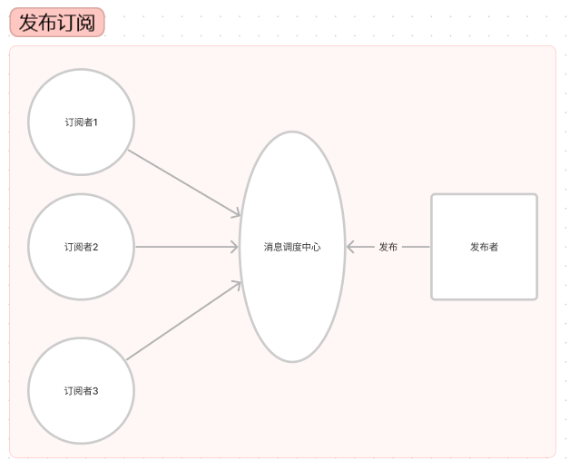
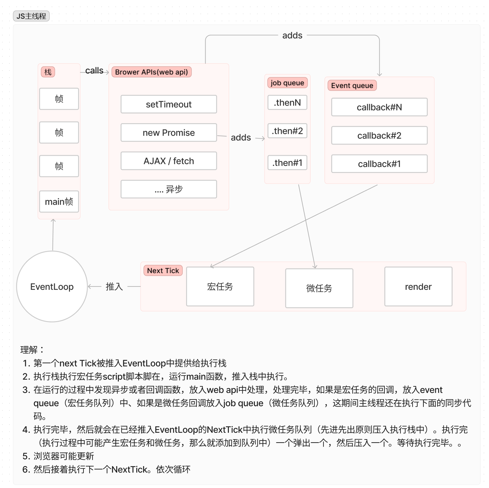
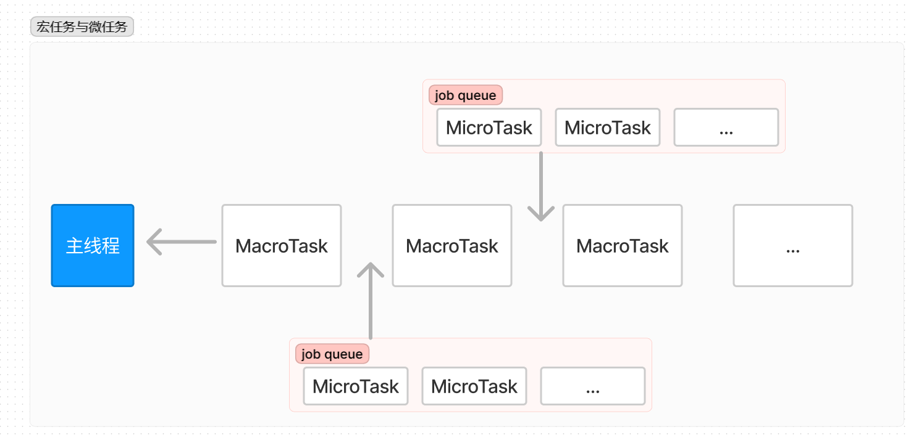
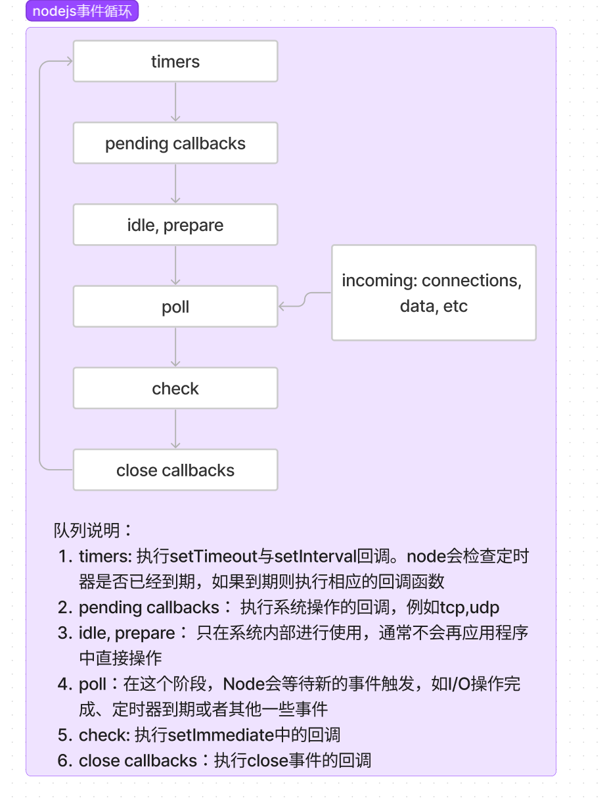
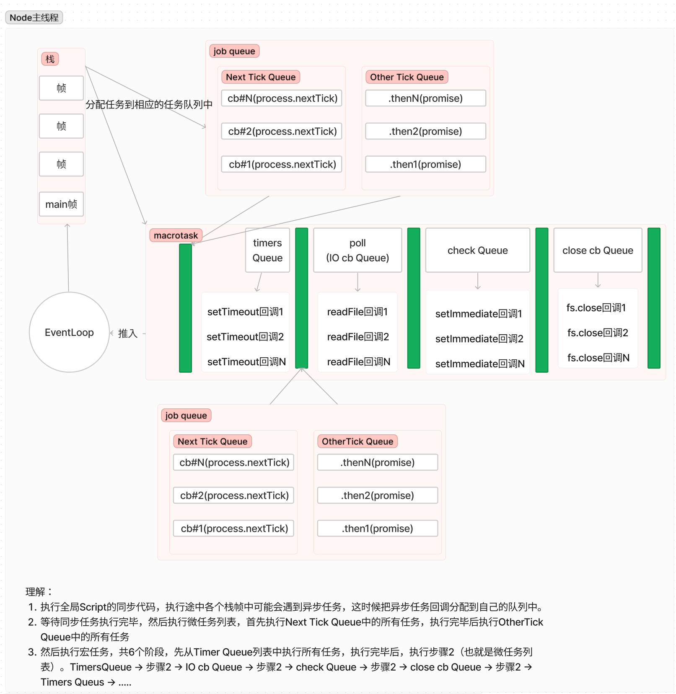

# 核心模块

## path

作用：用于处理文件/目录的路径

> const path = require('node:path)

- basename() 获取路径中最后一部分的名称，第二个参数可选，就是裁剪返回值的第二个字符串。
- dirname() 获取路径中目录路径名称
- extname() 获取路径中扩展名称。不标准的内容返回空字符串
- parse() 解析路径。返回一个对象，其属性表示路径的重要元素，具体见实例。basename, dirname,extname都可以从返回值对象中拿取。
- format() 序列化路径
- isAbsolute() 获取路径是否为绝对路径
- join() 拼接多个路径片段
- resolve() 返回绝对路径

- normalize() 规范化路径


```javascript
// basename
const path = require('node:path')

console.log(__filename) // D:\monorepo-project\packages\node\path.js
console.log(path.basename(__filename)) // node.js
// 如果参数1返回的内容以js结尾，那么就截断js文本，返回内容
console.log(path.basename(__filename, 'js')) // node.
console.log(path.basename("D:/monorepo-project/packages/node/")) // node
```

```javascript
// diename
const path = require('node:path')

console.log(__filename) // D:\monorepo-project\packages\node\path.js
// D:\monorepo-project\packages\node
console.log(path.dirname(__filename))
// /a/b
console.log(path.dirname('/a/b/c'))
// /a/b
console.log(path.dirname('/a/b/c/'))
```


```javascript
// basename
const path = require('node:path')

// D:\monorepo-project\packages\node\path.js
console.log(__filename)

// .js
console.log(path.extname(__filename))
// .js
console.log(path.extname('packages/node/path.map.js'))
// ''
console.log(path.extname('packages/node/path'))
// ''
console.log(path.extname('.js'))
```


```javascript
// format  对象解析成字符串路径
// parse 字符串路径解析成对象 

/**
 * parse 对象属性
 *  root
 *  dir
 *  base
 *  name
 *  ext
 */

const path = require('node:path')
/*
{
  root: 'D:\\',
  dir: 'D:\\monorepo-project\\packages\\node',
  base: 'path.js',
  ext: '.js',
  name: 'path'
}
 */
console.log(path.parse(__filename))
/*
{
  root: '',
  dir: 'monorepo-project/packages',
  base: 'node',
  ext: '',
  name: 'node'
}
 */
console.log(path.parse('monorepo-project/packages/node'))
/*
  {
    root: '/',
    dir: '/monorepo-project/packages',
    base: 'node',
    ext: '',
    name: 'node'
  }
 */
console.log(path.parse('/monorepo-project/packages/node/'))

```


```javascript
// isAbsolute 判断是否为绝对路径
const path = require('node:path')
console.log(path.isAbsolute('foo') ) // false
console.log(path.isAbsolute('/foo') ) // true
console.log(path.isAbsolute('./foo') ) // false
console.log(path.isAbsolute('../foo') ) // false
```


```javascript
// join 拼接路径
const path = require('node:path')

// a/b/c/index.html
console.log(path.join('a/b', 'c', 'index.html'))
// /a/b/c/index.html
console.log(path.join('/a/b', 'c', 'index.html'))
// /a/b/index.html
console.log(path.join('/a/b', 'c', '../', 'index.html'))
// /a/b/c/index.html
console.log(path.join('/a/b', 'c', '', 'index.html'))
```

```javascript
// resolve(from, to) 绝对路径
// 如果是字符串，则再当前工作目录上做拼接
// 如果是路径，
const path = require('node:path')
// D:\monorepo-project\packages\node\path.js
console.log(__filename)

// D:\monorepo-project\packages\node\a\b
console.log(path.resolve('a', 'b'))
// D:\b a和\b 没有任何关系，则返回盘符 + \b
console.log(path.resolve('a', '\b'))
// D:\b  \a 与 \b 没有任何关系，则返回盘符 + \b
console.log(path.resolve('\a', '\b'))
// D:\a\b \a可以与b字符做拼接路径
console.log(path.resolve('\a', 'b'))
```

```javascript
// normalize 规范化路径
const path = require('node:path')

// a\b\c\d 
console.log(path.normalize('a/b/c/d'))
// a\b\c..\d
console.log(path.normalize('a///b/c../d'))
// a\b\c\d 
console.log(path.normalize('a//\\b/c\\/d'))
// a\c\d b被转译了
console.log(path.normalize('a//\b/c\\/d'))
```

## Buffer


在node中，应用需要处理网络协议、操作数据库、处理图片、接收上传文件等，在网络流中和文件的操作中，还要处理大量二进制数据，js自有的字符串圆圆不能满足这些需求，于是Buffer对象就产生了。

Buffer一种用于处理二进制数据机制。它允许不经过js垃圾回收机制的情况下直接操作原始内存，从而更高效地处理数据。

Buffer是一个典型的JavaScript与c++结合的模块，它将性能部分用c++实现，将非性能相关的部分用JS实现。Buffer所占用的内存不是通过v8分配的，属于堆外内存。由于v8垃圾回收性能的影响，将常用的操作对象用更高效和专有的内存分配回收策略来管理。

由于Buffer太常见，Node在进程启动时就已经加载它，并将其放在全局对象上。所以Buffer在使用时，无需require/import引入即可使用。但是建议引入使用。

Buffer不占据V8堆内存大小的内存空间，内存的使用由Node的来控制，V8的GC进行回收

一般配合Stream流使用，充当数据缓冲区

```javascript
const { Buffer } = require('node:buffer')

const buf = new Buffer('我是buffer', 'utf-8')
console.log(buf)
console.log(buf.length) // 12
console.log(new Buffer('我是', 'utf-8').length) // 6
```

上面示例，不同编码字符串占用的元素个数不同，上面中文字符utf-8编码下占用3个元素,字母和半角标点符号占用一个元素。


为了使Buffer实例的创建更可靠、更不容易出错，各种new Buffer已被废弃，并由一下几个方法替代:

- `Buffer.from(array)` 返回一个新建的包含所提供的字节数组的副本的buffer
- `Buffer.from(arrayBuffer[, byteOffset[, length]])` 返回一个新建的与给定的ArrayBuffer共享同一内存的Buffer
- `Buffer.from(buffer)` 返回一个新建的包含所提供的Buffer的内容的副本的Buffer
- `Buffer.from(buffer[, encoding])` 返回一个新建的包含所提供的Buffer的内容副本的Buffer
- `Buffer.alloc(size[, fill[, encoding]])` 返回一个指定大小被填满的Buffer实例。
- `Buffer.allocUnsafe(size)`与`Buffer.allocUnsafeSlow(size)` 返回一个新建的指定size的buffer,但它的内容必须被初始化，使用使用buf.fill(0)填满（不安全）。
- `Buffer.concat([arr1, arrN][, totalLength])` 将多个buffer进行拼接，组成一个新的buffer。totalLength合并list中Buffer实例总长度
- `Buffer.isBuffer(buf)` 判断是否为Buffer数据

当调用 `Buffer.allocUnsafe()` 和 `Buffer.allocUnsafeSlow()` 时，被分配的内存段是未初始化的。虽然这样设计使得内存分配非常快，但已分配的内存段可能包含潜在的敏感旧数据。使用通过`Buffer.allocUnsafe()`创建的没有被完全重写内存的Buffer,在Buffer内存可读的情况下，可能泄露旧数据。

## fs

fs是node中内置核心模块

用户对于文件所具备的操作权限


常见flag操作符： r 可读、w 可写、s 同步、+ 执行相反操作、x 排它操作、a 追加操作

flags:

- r 可读
- r+ 读写
- rs+ 同步读写模式打开
- w 写入
- wx 类似w, 但如果path存在，则失败
- w+ 以读写模式。文件会创建(文件不存在)或截断（如果文件存在）
- wx 类似w, 但如果path存在，则失败
- wx+ 读写模式，但如果path存在，则失败
- a 追加模式。如果文件不存在，则会创建
- ax 类似于a, 但如果path存在，则失败
- a+ 以读取和追加模式
- ax+ 类似a+，  但如果path存在，则失败

mode: 写入文件时创建的文件的权限。默认为 0o666。这是一个八进制数字，通常表示文件的读取和写入权限。以下列举常见值：

- 0o100：表示可执行权限，文件所有者可以执行文件，但不能读取或写入。
- 0o200：表示可写权限，文件所有者可以写入文件内容，但不能读取或执行。
- 0o400：表示只读权限，文件所有者可以读取文件内容，但不能写入或执行。
- 0o644：表示常见的默认权限，文件所有者可读写，其他用户只能读取。
- 0o666: 允许文件的所有者、组和其他用户都可以读取和写入文件。也是是值438
- 0o600：表示文件的所有者可读写，但其他用户没有权限。
- 0o755：表示文件的所有者可读写执行，其他用户只能读取和执行。
- 0o777：表示最大权限，文件可读、可写、可执行，适用于文件的所有者、组和其他用户。

文件模式mode常量逻辑或创建的数字位掩码

|    常量       | 八进制 | 描述        |
|-----------|------|-----------|
| fs.constants.S_IRUSR | 0o200%  | 所有者可写入    |
|fs.constants.S_IXUSR |	0o100	| 所有者可执行/搜索 |
|fs.constants.S_IRGRP |	0o40	| 群组可读取     |
|fs.constants.S_IWGRP |	0o20	| 群组可写入     |
|fs.constants.S_IXGRP |	0o10	| 群组可执行/搜索  |
|fs.constants.S_IROTH |	0o4	| 其他人可读取    |
|fs.constants.S_IWOTH |	0o2	| 其他人可写入    |
|fs.constants.S_IXOTH |	0o1	| 其他人可执行/搜索 |

构建 mode 的一种更简单的方法是使用三个八进制数字的序列（例如 765）。 最左边的数字（示例中的 7）指定文件所有者的权限。 中间的数字（示例中的 6）指定群组的权限。 最右边的数字（示例中的 5）指定其他人的权限。

| 数值  | 描述 |
|------|----|
|7|	可读、可写和可执行|
|6|	可读和可写|
|5|	可读和可执行|
|4|	只读|
|3|	可写和可执行|
|2|	只写|
|1|	只可执行|
|0|	无权限|

例如，八进制值 0o765 表示：

- 所有者可以读取、写入、以及执行文件。
- 群组可以读取和写入文件。
- 其他人可以读取和执行文件。


### 文件操作

- `readFile(path[, 'utf8', cb(err, data) ])` 从指定文件中读取数据
- `writeFile(fileName, data[, options], callback(err))` 向指定文件中写入数据
- `appendFile(path, data[, options, cb(err)])` 追加的方式指定文件中写入数据
- `copyFile(originFile, targetFile[, mode], cb())` 将 src 复制到 dest。 默认情况下，如果 dest 已经存在，则会被覆盖。
- `fs.watch(filename[, options][, listener])` 监视 filename 的变化，其中 filename 是文件或目录。

```javascript
// 文件复制操作
const fs = require('node:fs');
const path = require('node:path');

const originFile = path.resolve(__dirname, 'path.js')
const targetFile = path.resolve(__dirname, 'path-copy.js')

fs.readFile(originFile, 'utf-8', (err, data) => {
  if(err) throw new Error(err)
  console.log(data.toString())
  fs.writeFile(targetFile, data, (err, data) => {
    if(err) throw new Error(err)
    fs.appendFile(targetFile, '\/* 我是追加的注释内容*\/', { encoding: 'utf8' }, (err) => {
      if(err) throw new Error(err)
      console.log('成功')
    })
  })
})
```

### 大文件读写

- `fs.open(path[, flags[, mode]], callback(err, fd))` 打开文件。如果不问不存在则会创建
- `fs.close(fd, cb)` 关闭文件描述符
- `fs.read(fd, buffer, offset, length, position, callback(err, bytesRead, buffer))` 从 fd 指定的文件中读取数据。
- `fs.read(fd[, options], callback)`
- `fs.read(fd, buffer[, options], callback)`
- `fs.write(fd, buffer, offset[, length[, position]], callback(err, bytesWritten, buffer))` 将buffer写入fd指定文件。offset确定要写入的缓冲区部分、length是整数，指定要写入的字节数。position 指从文件开头数据应被写入的偏移量。
- `fs.write(fd, buffer[, options], callback)`
- `fs.write(fd, string[, position[, encoding]], callback)`

```javascript
// 移动大文件
const fs = require('node:fs');
const path = require('node:path');
const { Buffer } = require('node:buffer')

const originFile = path.resolve(__dirname, 'big-file.mp4');
const targetFile = path.resolve(__dirname, 'big-file-copy.mp4');

// const originFile = path.resolve(__dirname, 'path.js');
// const targetFile = path.resolve(__dirname, 'path-copy-copy.js');

const BUFFER_LEN = 10
let read_position = 0 
const buf = Buffer.alloc(BUFFER_LEN)
const start = new Date().getMilliseconds()
function loopWrite(o_fd, t_fd, read_len) {
  // 参数： fd, buffer, buffer偏移量，buffer文件读取数据位置，buffer长度
  fs.read(o_fd, buf, 0, read_len, read_position,(err, bytesRead /* 读取字节数 */, buffer /* 就是buf */) => {
    if(err) throw new Error(err);
    // 参数： fd, buffer, 当前buffer的偏移量，文件开头数据应被写入的偏移量
    fs.write(t_fd, buffer, 0, bytesRead, (err, bytesWritten, buffer) => {
      if(err) throw new Error(err);
      if(bytesRead) {
        read_position += bytesRead
        loopWrite(o_fd, t_fd, read_len)
      } else {
        fs.close(o_fd)
        fs.close(t_fd)
        console.log('成功')
        console.log((new Date().getMilliseconds() - start) / 1000 + ' s')
      }
    }) 
  })
}

fs.open(originFile, 'r', 0o666, (err, o_fd) => {
  if(err) throw new Error(err);
  fs.open(targetFile, 'w', 0o666, (err, t_fd) => {
    if(err) throw new Error(err);
    loopWrite(o_fd, t_fd, BUFFER_LEN)
  })
})
```


### 目录操作

- `fs.access(path[, mode], callback(err))` 判断文件或目录是否具有操作权限
- `fs.stat(path[, { bigint: false }], callback(err, stats))` 获取目录及文件信息。[stats](https://www.nodejs.com.cn/api/fs.html#class-fsstats)是一个类
- `fs.mkdir(path[, { recursive: false, mode: 0o777 }], callback(err, path))` 创建目录。recursive：true递归创建目录
- `fs.rmdir(path[, options],callback(err))` 删除目录。recursive递归删除
- `fs.readdir(path[, options], cb(err, files))` 读取目录中的内容。`files: <string[]> | <Buffer[]> | <fs.Dirent[]>`
- `fs.unlink(path, cb(err))` 删除指定文件

## stream

流（stream）在 Node.js 中是处理流数据的抽象接口（abstract interface）。 stream 模块提供了基础的 API 。使用这些 API 可以很容易地来构建实现流接口的对象。

node中又四中基本的流类型：

- Readable（可读流） fs.createReadStream(path[, options])
  - 提供close、data、end、error、readable事件
- Writable（可写流） fs.createWriteStream
  - 提供close、drain、error、finish、pipe、unpipe、writable事件
- Duplex（双向流） 可读写的流 net.Socket
- Transform（转换流） 在读写过程中可以修改和变换数据的Duplex流 zlib.createDeflate()

node创建的流对象都只能操作strings和buffer对象，所有的流都是 EventEmitter 的实例。但是一些第三方的实现，依旧能够处理其他类型的jS值（除null）。这些流被认为是工作中的”对象模式“

```javascript
// 文件可读流
const fs = require('node:fs');
const path = require('node:path');

// fs.ReadStream  这个实例
let rs = fs.createReadStream(path.resolve(__dirname, 'path-copy.js'), {
  flags: 'r',
  encoding: null, // buffer
  fd: null,
  mode: 438,
  autoClose: true, // 自动关闭文件
  start: 0, // 文件开始位置读取
  // end: ,
  highWaterMark: 64 * 1024,
})

// 传递给消费者时候触发
rs.on('data', (chunk) => {
  console.log(chunk.toString())
})

rs.on('end', () => {
  console.log('没有可供消费时触发')
})

rs.on('error', (err) => {
  console.log(err)
})
```


## vm

源代码: lib/vm.js

node:vm 模块允许在 V8 虚拟机上下文中编译和运行代码。

node:vm 模块不是安全的机制。 不要使用它来运行不受信任的代码。

JavaScript 代码可以立即编译并运行，也可以编译、保存并稍后运行。

常见的用例是在不同的 V8 上下文中运行代码。 这意味着被调用的代码与调用代码具有不同的全局对象。

可以通过上下文隔离化一个对象来提供上下文。 调用的代码将上下文中的任何属性视为全局变量。 由调用的代码引起的对全局变量的任何更改都反映在上下文对象中。


```javascript
const vm = require('node:vm');

const x = 1;

const context = { x: 2 };
vm.createContext(context); // 上下文隔离化对象。

const code = 'x += 40; var y = 17;';
// `x` 和 `y` 是上下文中的全局变量。
// 最初，x 的值为 2，因为这是 context.x 的值。
vm.runInContext(code, context);

// 访问沙箱
console.log(context.x); // 42
console.log(context.y); // 17

console.log(x); // 1; y 未定义。
```

## require

```javascript
// index.js
const sum = require('./sum')
// sum.js
const sum = (a, b) => {
  return a + b
}
module.export = sum
```

### require源码

vscode 打开调试，点击创建launch.json文件，注释掉skipFiles数组里面的`<node_internals/**>`。

```json
{
  // 使用 IntelliSense 了解相关属性。 
  // 悬停以查看现有属性的描述。
  // 欲了解更多信息，请访问: https://go.microsoft.com/fwlink/?linkid=830387
  "version": "0.2.0",
  "configurations": [
    {
      "type": "node",
      "request": "launch",
      "name": "启动程序",
      "skipFiles": [
        // "<node_internals>/**"
      ],
      "program": "${workspaceFolder}\\index.js"
    }
  ]
}
```

断点第一行，单步执行

```javascript
function Module(id = '', parent) {
  this.id = id;
  this.path = path.dirname(id);
  setOwnProperty(this, 'exports', {});
  moduleParentCache.set(this, parent);
  updateChildren(parent, this, false);
  this.filename = null;
  this.loaded = false;
  this.children = [];
  let redirects;
  if (policy?.manifest) {
    const moduleURL = pathToFileURL(id);
    redirects = policy.manifest.getDependencyMapper(moduleURL);
    // TODO(rafaelgss): remove the necessity of this branch
    setOwnProperty(this, 'require', makeRequireFunction(this, redirects));
    // eslint-disable-next-line no-proto
    setOwnProperty(this.__proto__, 'require', makeRequireFunction(this, redirects));
  }
  this[require_private_symbol] = internalRequire;
}

// 编译执行
Module.prototype.load = function(filename) {
  this.filename = filename;
  this.paths = Module._nodeModulePaths(path.dirname(filename));
  // 获取文件后缀
  const extension = findLongestRegisteredExtension(filename);
  // 编译执行 .js(module, filename) .json(module, filename) .node(module, filename)
  Module._extensions[extension](this, filename);
}

Module._extensions['.js'] = function(module, filename) {
  // If already analyzed the source, then it will be cached.
  const cached = cjsParseCache.get(module);
  let content;
  if (cached?.source) {
    content = cached.source;
    cached.source = undefined;
  } else {
    // 读取内容
    content = fs.readFileSync(filename, 'utf8');
  }
  // .... 包装
  module._compile(content, filename);
};

Module.prototype._compile = function(content, filename) {
  // 这里就是对字符串进行包装
  // ƒ (exports, require, module, __filename, __dirname) {\n\nconst sum = require('./005_file2');\nconsole.log(sum(1,2))\n\n\n}
  const compiledWrapper = wrapSafe(filename, content, this);
  
  const dirname = path.dirname(filename);
  const require = makeRequireFunction(this, redirects);
  let result;
  const exports = this.exports;
  const thisValue = exports;
  const module = this;
  if (requireDepth === 0) statCache = new SafeMap();
  if (inspectorWrapper) {
    result = inspectorWrapper(compiledWrapper, thisValue, exports,
      require, module, filename, dirname);
  } else {
    result = ReflectApply(compiledWrapper, thisValue,
      [exports, require, module, filename, dirname]);
  }
  hasLoadedAnyUserCJSModule = true;
  if (requireDepth === 0) statCache = null;
  return result;
};

Module.prototype.require = function(id) {
  // 这个id 就是require 的路径
  // this 就是引入文件的模块
  return Module._load(id, this, /* isMain */false)
}


Module._load = function(request, parent, isMain) {
  if(parent) {
    // parent.path 就是当前文件的目录
    const relResolveCacheIdentifier = `${parent.path}\x00${request}`;
    // 判断缓存里面是否有该文件
    const filename = relativeResolveCache[relResolveCacheIdentifier];
    if(filename !== undefined) { }
  }
  // 返回文件的绝对路径，并把文件后缀做拼接
  const filename = Module._resolveFilename(request, parent, isMain);
  const cachedModule = Module._cache[filename];
  if(cachedModule !== undefined) {}
  const module = new Module(filename, parent)
  Module._cache[filename] = module
  if(parent !== undefined) {
    relativeResolveCache[relResolveCacheIdentifier] = filename
  }
  let threw = true;
  module.load(filename)
  threw = false
  return module.exports;
}


function makeRequireFunction() {
  const mod = new Module()
  // return require
  return function(path) {
    return mod.require(path)
  }
}
```


### 实现require模块

- 路径分析
- 缓存优化
- 文件定位
- 编译执行

## events

源代码: lib/events.js

Node.js 的大部分核心 API 都是围绕惯用的异步事件驱动架构构建的，在该架构中，某些类型的对象（称为"触发器"）触发命名事件，使 Function 对象（"监听器"）被调用。

Events模块提供EventEmitter类，nodejs中很多内置核心模块继承EventEmitter

```javascript
const { EventEmitter } = require('node:events');

const event = new EventEmitter()

event.on('event', () => {
  console.log('我被触发了')
})
event.emit('event')
```

### 发布订阅

定义对象间一对多的依赖关系。



要素：缓存队列，存放订阅者信息、具有增加、删除订阅能力、状态改变是通知所有订阅者执行监听。


```javascript
class EventEmitter {
  constructor() {
    this.sups = {}
  }
  emit(eventName, ...args) {
    this.sups[eventName]?.forEach(function(item) {
      return item.apply(this, ...args)  
    })
  }
  on(eventName, cb) {
    if(this.sups[eventName]) {
      this.sups[eventName].push(cb)
    } else {
      this.sups[eventName] = [cb]
    }
  }
}

const ev = new EventEmitter()


ev.on('handleClick', (...args) => {
  console.log(args)
})

ev.emit('handleClick', 1, 2, 3)
ev.emit('handleClick', 1, 2)
```

### 源代码


```javascript
function EventEmitter(opts) {
  EventEmitter.init.call(this, opts);
}

const kCapture = Symbol('kCapture');

EventEmitter.init = function(opts) {
  this._events = Object.create(null);
}
```

```javascript
// on 
EventEmitter.prototype.on = function addListener(type, listener) {
  return _addListener(this, type, listener, false);
};

function _addListener(target, type, listener, prepend) {
  // target._events 消息调度中心
  events = target._events = Object.create(null);
  const existing = events[type]
  if(existing === undefined) {
    events[type] = listener
  }
  return target
}
EventEmitter.prototype.emit = function emit(type, ...args) {
  const events = this._events;
  const handler = events[type];
  if (handler === undefined) return false;
  if(typeof handler === "function") {
    const result = handler.apply(this, args);
    // 这里添加到缓存里面，下次直接拿出来
    if (result !== undefined && result !== null) {
      addCatch(this, result, type, args);
    }
  } else {
    // 数组 [ f on(), f on(), f on(), ...]
    const len = handler.length;
    const listeners = arrayClone(handler);
    for (let i = 0; i < len; ++i) {
      const result = listeners[i].apply(this, args);

      // We check if result is undefined first because that
      // is the most common case so we do not pay any perf
      // penalty.
      // This code is duplicated because extracting it away
      // would make it non-inlineable.
      if (result !== undefined && result !== null) {
        addCatch(this, result, type, args);
      }
    }
  }

  return true;
}

```

## EventLoop

[JS内存管理机制](https://juejin.cn/post/7200956719978790967)

[并发模型与事件循环](https://developer.mozilla.org/zh-CN/docs/Web/JavaScript/Event_loop)

堆（先进后出）：对象被分配在堆中，堆是一个用来表示一大块（通常是非结构化的）内存区域的计算机术语。

队列（先进先出）：JS运行时包含一个待处理消息的消息队列。每一个消息都关联着一个用以处理这个消息的回调函数。

JS运行机制是：

1. 所有同步任务都在主线程上执行，形成一个执行栈（一个调用栈）
2. 脚本或函数调用时，都会添加到调用堆栈的顶部，函数退出时，解释器都会将其从调用栈中删除。
3. 主线程之外，还存在任务队列（task queue），只要异步任务有了运行结果，就在任务队列中放置一个事件。
4. 直到执行栈中的所有同步任务执行完毕，系统就会读取“任务队列”
5. 任务队列中的任务就会先进先出放入栈中执行栈中执行
6. 然后依次循环，这就是时间循环

JS中又两种异步任务：

- 宏任务：script、setTimeout、setInterval、setImmediate、I/O、UI rendering
- 微任务：process。nextick(Node.js), Promises, Object.observe, MutationObserver

JS有一个事件循环的并发模型，事件循环负责执行代码、收集、处理事件与及执行队列中的子任务。


函数调用形成了一个由若干帧组成的栈。

```javascript
function foo(b) {
  let a = 10;
  return a + b + 11;
}

function bar(x) {
  let y = 3;
  return foo(x * y);
}

console.log(bar(7)); // 返回 42
```

1. 当调用bar时，第一个帧被创建并压入栈中，帧中包含了bar的参数和局部变量。
2. 当bar调用foo时，第二帧被创建并压入栈中，放在第一帧上面，帧中包含foo参数和局部变量（有点像作用域的范围）
3. 当foo执行完毕然后返回时，第二帧就被弹出栈。
4. 当bar夜之星完毕，然后返回时，第一个帧也被弹出，栈被清空。

上面函数符合[尾调用优化](../base/function#尾调用优化)

```javascript
console.log('script start');

setTimeout(function () {
  console.log('setTimeout');
}, 0);

Promise.resolve()
  .then(function () {
    console.log('promise1');
  })
  .then(function () {
    console.log('promise2');
});

console.log('script end');
```

根据上面描述分析，

1. script被压入进栈，以宏任务身份运行，代表整个文件的执行，该函数被添加到调用堆栈中
2. 打印 script start
3. setTimout执行完成（不在主线程上运行）,而是借助web api的执行，从而将回调添加到宏任务队列中，等待主线程同步任务执行完毕
4. 然后执行promise（同步），发现第一个回调加入微任务队列（第一个回调加入）
5. 继续向下执行，遇到日志并打印 script end
6. 宏任务结束，script 弹出栈
7. EventLoop会从消息队列中依次会把回调函数放入主线程中处理（先进先出）由于setTimeout是宏任务队列中，优先级没有微任务队列高，所以先处理微任务队列
8. 微任务队列这时候只有promise的第一个回调，所以把它压入栈中执行，微任务出列，遇到日志打印 promise1，继续执行发现有第二个回调，那么就压入微任务队列中，.
9. 就此第一个微任务结束，弹栈。将处理下一个微任务，然后将第二个回调压入栈中执行遇到日志打印 promise2。执行完毕，第二个微任务结束，弹栈。
10. 这样就完成一次任务，浏览器可能会更新渲染
11. setTimeout压入栈中，并执行，执行完毕后弹栈

[模拟地址](https://jakearchibald.com/2015/tasks-microtasks-queues-and-schedules/)


```javascript
setTimeout(() => {
  console.log('s1')
  Promise.resolve().then(() => {
      console.log('p1-1')
  })
  Promise.resolve().then(() => {
    console.log('p1-2')
  })
})
setTimeout(() => {
  console.log('s2')
  Promise.resolve().then(() => {
    console.log('p2-1')
  })
  Promise.resolve().then(() => {
    console.log('p2')
  })
})
```

1. script脚本压入栈底，以宏任务执行。
2. 浏览器页面可能更新
3. 执行第一行遇见setTimeout, 给放入web api处理执行完毕，回调给宏任务队列 
4. 接着继续执行又遇见setTimeout, 给web api处理执行完毕，回调给宏任务队列 
5. script栈中弹出。主线程中没有任务，去EventLoop中寻找微任务队列，也发现没有任务，又去EventLoop中宏任务队列中寻找。发现两个 
6. setTimeout先执行完毕的（这个执行完不是里面的回调执行，而是setTimeout本身的执行），先进入宏任务队列，先进先出原则，所以执行第一个 
7. 发现回调函数第一行就是打印日志，输出‘s1’ 
8. 然后执行函数第二行，执行Promise.resolve(),然后执行.then发现是个回调函数，执行回调放入微任务队列中 
9. 然后执行下一行代码，又发现Promise.resolve(),然后执行.then发现是个回调函数，执行回调也放入微任务队列中 
10. 又发现执行栈中没有任务，于是去EventLoop的微任务中寻找发现两个，先进先出的原则。
11. 第一个压入执行栈中执行，打印输出p1-1,弹栈，原来第二个（现在第一个）压入栈中执行，并打印输出p1-2
12. 现在微任务中也没有了。
13. 浏览器页面可能更新
14. 那么去宏任务中寻找，于是找到一个，压入 
15. 第一行日志打印 s2 
16. 第二行遇到Promise.resolve()函数并执行，然后执行.then发现是个回调函数，执行回调放入微任务队列中 
17. 然后执行下一行代码，又发现Promise.resolve(),然后执行.then发现是个回调函数，执行回调也放入微任务队列中 
18. 又发现执行栈中没有任务，于是去EventLoop的微任务中寻找发现两个，先进先出的原则。 
19. 第一个压入执行栈中执行，打印输出p2-1,弹栈，原来第二个（现在第一个）压入栈中执行，并打印输出p2-2 
20. 现在微任务中也没有了，那么去宏任务中寻找也没有了



简单图解如下：



## node事件循环


[官方文档](https://nodejs.org/zh-cn/docs/guides/event-loop-timers-and-nexttick)


事件循环是 Node.js 处理非阻塞 I/O 操作的机制——尽管 JavaScript 是单线程处理的——当有可能的时候，它们会把操作转移到系统内核中去。

因为目前大多数内核都是多线程的，所以它们可以在后台处理多种操作。当其中的一个操作完成的时候，内核通知 Node.js 将适合的回调函数添加到 轮询 队列中等待时机执行。


当 Node.js 启动后，它会初始化事件循环，处理已提供的输入脚本，它可能会调用一些异步的 API、调度定时器，或者调用 process.nextTick()，然后开始处理事件循环



各种类型的宏任务任务主要集中在四个队列中：`Timers Queue`、`IO Callbacks Queue`、`Check Queue`、`Close Callbacks Queue`。

微任务主要有两个，不同的微任务放在不同微任务队列中：`Next Tick Queue`防止process.nextTick(callback)回调任务、`Other Micro Queue`防止其他microtask,比如promise等

node完整事件环：

1. 执行同步代码，将不同的任务添加至队列中
2. 所有同步代码执行完毕后，执行microtask微任务，先执行所有next Tick Queue中的所有任务,再执行Other Microtask Queue中的所有任务
3. 所有微任务执行后会，执行macrotask宏任务，共6个阶段，从第1个阶段开始执行相应每一个阶段macrotask中的所有任务，注意，这里是所有每个阶段宏任务队列的所有任务，在浏览器的Event Loop中是只取宏队列的第一个任务出来执行，每一个阶段的macrotask任务执行完毕后，开始执行微任务，也就是步骤2
4. Timers Queue -> 步骤2 -> I/O Queue -> 步骤2 -> Check Queue -> 步骤2 -> Close Callback Queue -> 步骤2 -> Timers Queue ...... 
5. 重复1 - 4过程。



```javascript
setTimeout(() => { // -> 宏任务 timer队列
  console.log('s1')
})

Promise.resolve().then(() => { // 微任务队列
  console.log('p1')
})

console.log('start') // 输出

process.nextTick(() => { // 微任务队列 Next Tick Queue
  console.log('tick')
})

setImmediate(() => { // 宏任务 check队列
  console.log('setImmediate')
})

console.log('end') // 输出

// start
// end
// tick nextTick优先级比promise优先级高
// p1
// s1
// setImmediate
```


## 为什么需要EventLoop?

因为 JavaScript 是单线程的。单线程就意味着，所有任务需要排队，前一个任务结束，才会执行后一个任务。如果前一个任务耗时很长，后一个任务就不得不一直等着。为了协调事件（event），用户交互（user interaction），脚本（script），渲染（rendering），网络（networking）等，用户代理（user agent）必须使用事件循环（event loops）。


