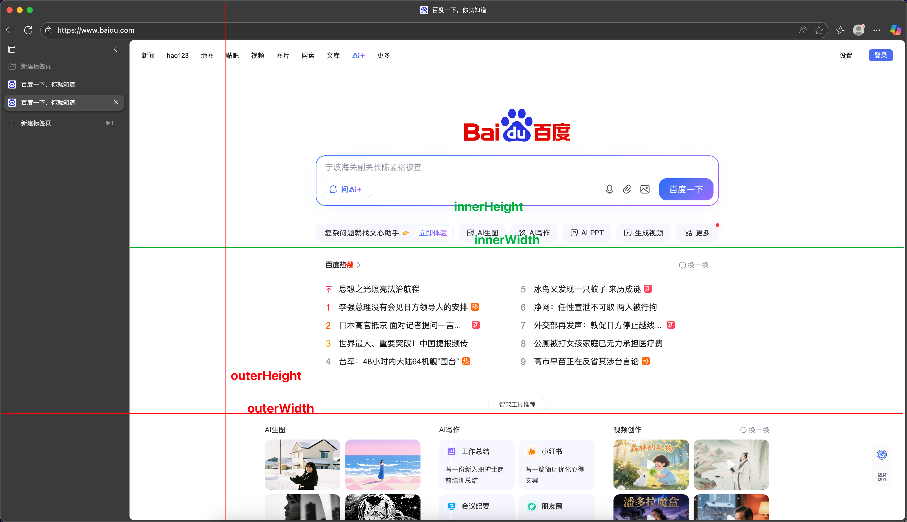

# JS


## Element 拖拽

- mousedown: 按钮在元素内按下时，会在该元素上触发 
- mousemove: 鼠标在元素内移动时，会在该元素上触发
- mouseup: 按钮在元素内释放时，会在该元素上触发

- mouseenter: 鼠标进入元素时，会在该元素上触发
- mouseleave: 鼠标离开元素时，会在该元素上触发
- mouseout: 鼠标离开元素时，会在该元素上触发


```typescript
// MouseEvent extends UIEvent extends Event
Element.addEventListener("mousedown", (event) => {});
```


## window


### outerHeight、innerHeight

- outerHeight 代表浏览器本身的高度（包含顶部区域）
- innerHeight 代表文档可视区域高度（不包含顶部与滚动隐藏部分）



计算顶部地址栏的高度：outerHeight - innerHeight
计算左侧长度：outerWidth - innerWidth 


## setTimeout

`setTimeout(functionRef, delay, param1, param2, /* …, */ paramN)`

setTimeout 如果delay为0，是否会立即执行, 还有如果delay超过int的最大值，会被立即执行。