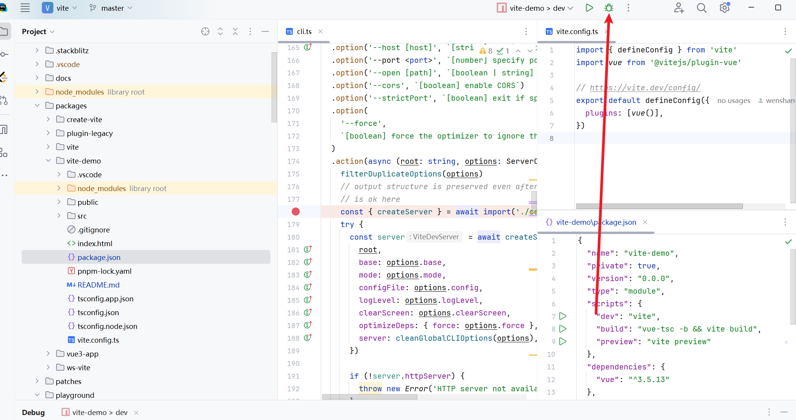
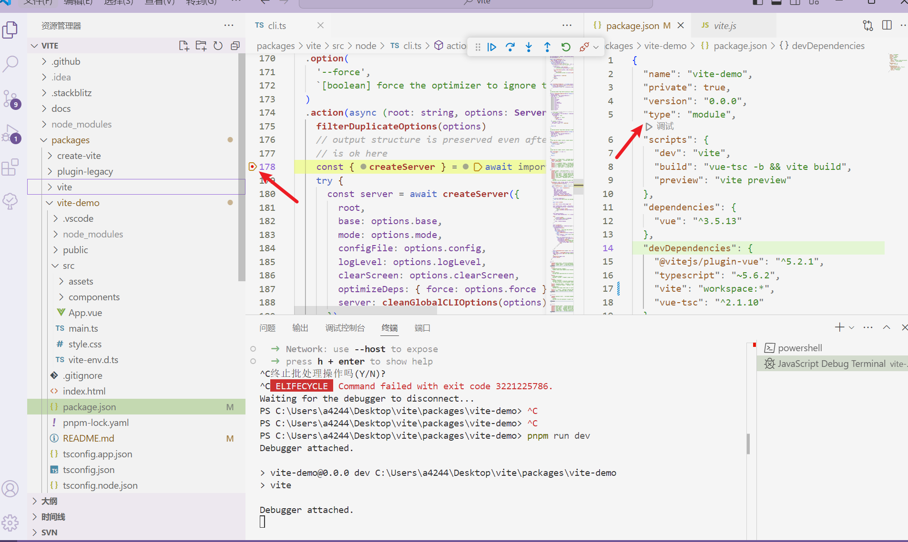

# 源码


## 调试vite源代码

```bash
pnpm install esbuild -D
```

启动：` "dev": "tsx scripts/dev.ts",`

拉下vite代码，然后在packages或playground目录下建一个调试工程，把工程下的vite依赖改成"ws-vite": "workspace:*"，然后在vite源代码中打debugger, 以debugger形式执行，会直接断点过去



vscode调试也是一样，先更改调试工程vite依赖，然后在vite源代码处打debugger, 就可以在调试工程packages.json中点击调试，然后选择命令就行。




## mini vite

搭建monorepo工程

> pnpm i typescript tsx @types/node rollup -D -w

- `packages/vite`

> pnpm i cac -D
> pnpm i rollup esbuild

::: tips 
为什么要把自rollup esbuild 安装到 dependencies 中，因为在用户开发的时候需要用到rollup（Rollup 不仅用于生产环境的打包，它还提供了 插件系统 和 模块图分析。Vite 的开发服务器在很大程度上是基于 Rollup 的插件钩子构建的。）和esbuild（依赖预构建 和 TS/JSX 转译，在 Vite 的核心服务启动阶段被调用）
:::

- [cac](https://www.npmjs.com/package/cac) 一个用于构建CLI应用程序的JavaScript库
  - `cli.option`
  - `cli.version`
  - `cli.help`
  - `cli.parse`


