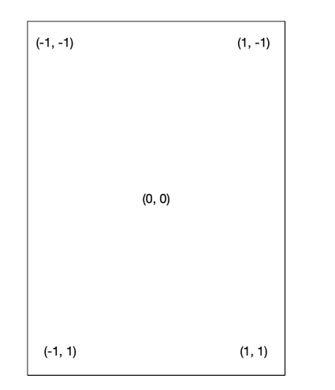

# 一切皆组件

从布局来看，官方把Flutter布局分为Basic widgets, Single-child和Multi-child。

在组件划分上：Container、Row、Column在官方文档里属于基础组件。但是Container又属于单一子元素组件（Single-child）。而Row,Column又属于（Multi-child）。


在单一子组件（Single-child）,包括Container、Padding、Center、Align、FittedBox、AspectRatio等。

在Flutter中，使用最多的就是Container, 接收Alignment对象，需要两个参数：`double x`和`double y`，取值范围`[-1, 1]`之间。


## Container组件

```dart
class Container extends StatelessWidget {
  Container({
    super.key,
    this.alignment, // 方位：上下左右排列元素
    this.padding,
    this.color,
    this.decoration,
    this.foregroundDecoration,
    double? width,
    double? height,
    BoxConstraints? constraints, // 限制空间和大小
    this.margin,
    this.transform,
    this.transformAlignment,
    this.child,
    this.clipBehavior = Clip.none,
  }): ....
  final AlignmentGeometry? alignment;
}
abstract class AlignmentGeometry { 
  double get _x;
  double get _start;
  double get _y;
}
```




从上图（第二象线坐标系），使用代码让文字居中

```dart
import 'package:flutter/material.dart';

void main() {
  runApp( const MyApp() );
}

class MyApp extends StatelessWidget {
  const MyApp({super.key});

  @override
  Widget build(BuildContext context) {
    return Container(
      color: Colors.green,
      alignment: const Alignment(0, 0), // 居中， 左下角(-1, 1)
      // 没有textDirection: TextDirection.ltr 就会报错no Directionality widget found
      child: const Text("Container", textDirection: TextDirection.ltr),
    );
  }
}
```

Flutter也提供了位置常量：

- Alignment.center == Alignment(0.0, 0.0)
- Alignment.centerLeft == Alignment(-1.0, 0.0)
- Alignment.topCenter == Alignment(0.0, -1.0)
- Alignment.topLeft == Alignment(-1.0, -1.0)
- Alignment.topRight == Alignment(1.0, -1.0)
- Alignment.bottomCenter == Alignment(0.0, 1.0)
- Alignment.bottomLeft == Alignment(-1.0, 1.0)
- Alignment.bottomRight == Alignment(1.0, 1.0)
- Alignment.centerRight == Alignment(1.0, 0.0)


- Text组件最简单


源代码

```dart
class Text extends StatelessWidget {
  const Text(String this.data, {
    super.key,
    this.style, // 
    this.strutStyle,
    this.textAlign,
    this.textDirection,
    this.locale,
    this.softWrap,
    this.overflow,
    this.textScaleFactor,
    this.maxLines,
    this.semanticsLabel,
    this.textWidthBasis,
    this.textHeightBehavior,
    this.selectionColor,
  }) : textSpan = null;
  // ...
  final TextStyle? style;
}
```