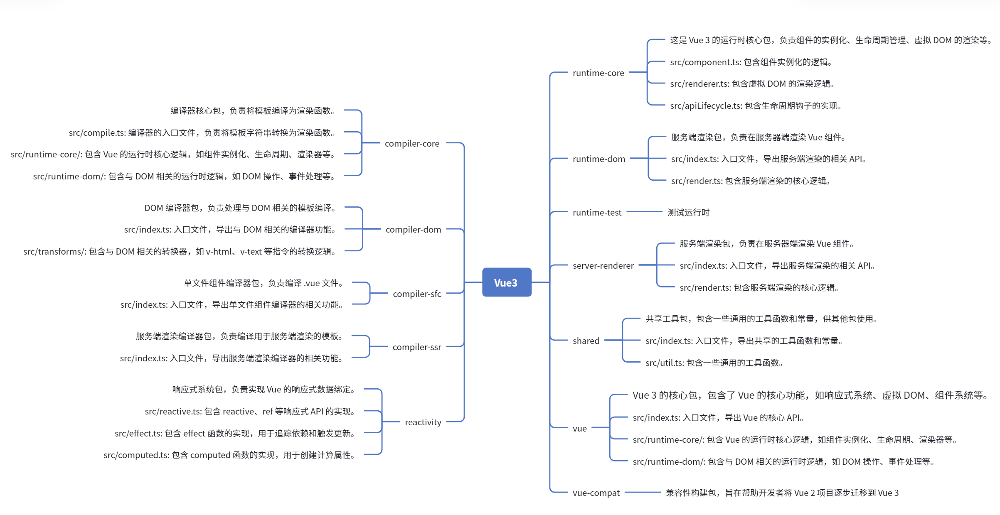

# 简介

## 1. 理解 Vue 3 的架构和核心概念

- 响应式系统：了解 Vue 3 使用的响应式系统，主要通过 Proxy 实现数据的代理和依赖追踪。
- 组件化：Vue 3 是组件驱动的框架，你需要理解如何定义和渲染组件。
- 虚拟 DOM：Vue 使用虚拟 DOM 来提高渲染效率，你需要理解如何将模板转换为虚拟 DOM 树。
- 生命周期：组件的生命周期钩子是 Vue 框架中的重要部分，需要了解如何管理组件的生命周期。

## 2. 实现一个响应式系统

- 数据代理（Proxy）：用 Proxy 实现对象的拦截，使得数据的读取、修改、删除都能被监控和追踪。
- 依赖收集与更新：实现依赖收集和更新机制，即当数据发生变化时，能够通知相应的组件或 DOM 更新。
- 最简单的实现：
  - 创建一个响应式函数，利用 Proxy 拦截对象的访问。
  - 定义一个“依赖收集”机制，记录哪些组件或函数依赖于哪些数据属性。
  - 当数据变化时，触发对应的更新。

## 3. 实现虚拟 DOM

- 虚拟 DOM 节点：虚拟 DOM 是一个 JavaScript 对象，它描述了 UI 结构，而不是直接操作 DOM。
- 渲染函数：创建一个渲染函数，将模板转换为虚拟 DOM 树。Vue 3 使用 h 函数创建虚拟节点（VNode）。
- Diff 算法：实现一个简单的 Diff 算法，通过对比旧的虚拟 DOM 树和新的虚拟 DOM 树来最小化对 DOM 的操作。
- DOM 更新：根据 Diff 结果，将虚拟 DOM 树转换成真实的 DOM 树，并且进行更新。

## 4. 组件化和模板编译
- 组件定义：定义如何创建 Vue 组件，组件包含数据、模板、方法等。
- 模板编译：实现一个简单的模板编译器，将模板转换为渲染函数。在 Vue 3 中，模板编译最终生成渲染函数，它会返回虚拟 DOM 树。
- 渲染函数：在组件渲染时，调用渲染函数并生成虚拟 DOM。

## 5. 生命周期钩子

- 初始化和销毁钩子：实现组件的生命周期钩子，支持 mounted、updated、destroyed 等钩子。
- 生命周期管理：确保在适当的时机调用这些钩子，以管理组件的创建、更新和销毁过程。

## 6. 自定义指令与事件处理
- 自定义指令：实现类似 Vue 中的 v-if、v-for、v-bind 等指令功能。
- 事件监听与更新：实现事件绑定和处理机制，支持 v-on 等指令的事件监听。

## 7. 渲染与更新

- 更新策略：确保只有数据变更时才触发视图更新。实现类似 Vue 的异步更新策略，避免多次重复渲染。
- 依赖关系管理：每次组件渲染时，需要确保正确管理数据依赖，避免不必要的更新。

## 8. 优化和扩展

- 性能优化：优化虚拟 DOM 的 Diff 算法，减少不必要的 DOM 操作，增加批量更新机制等。
- 扩展功能：添加插件、全局属性、提供更多的 API 等。

## 9.总结步骤

1. 理解核心概念（响应式系统、组件化、虚拟 DOM、生命周期）。
2. 实现响应式系统（Proxy、依赖追踪）。
3. 实现虚拟 DOM（VNode、Diff、DOM 更新）。
4. 实现模板编译（将模板转为渲染函数）。
5. 生命周期管理（组件的生命周期钩子）。
6. 自定义指令与事件处理（事件绑定、指令处理）。
7. 渲染与更新机制（优化渲染流程）。
8. 性能优化和扩展（提升框架性能、功能扩展）。
