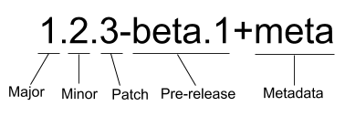
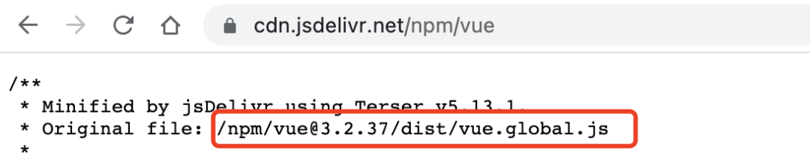

# package.json配置详细解读

主要参考Vite配置文件

## 1. 描述配置

主要是项目的基本信息，包括名称，版本，描述，仓库，作者等，部分会展示在 npm 官网上。

### name

项目的名称，如果是第三方包的话，其他人可以通过该名称使用 npm install 进行安装。

```text
"name": "vite"
```


### version



- 项目的版本号，开源项目的版本号通常遵循 semver 语义化规范，具体规则如下图所示
    - 1 代表主版本号 Major，通常在涉及重大功能更新，产生了破坏性变更时会更新此版本号
    - 2 代表次版本号 Minor，在引入了新功能，但未产生破坏性变更，依然向下兼容时会更新此版本号
    - 3 代表修订号 Patch，在修复了一些问题，也未产生破坏性变更时会更新此版本号
    - 关于 semver 规范更多的内容，可以[参考](https://juejin.cn/post/7122240572491825160)。

```json
{"version": "6.0.2"}
```

### repository

项目的仓库地址以及版本控制信息。

```json
"repository": {
    "type": "git",
    "url": "git+https://github.com/vitejs/vite.git",
    "directory": "packages/vite"
}
```

### description

项目的描述，会展示在 npm 官网，让别人能快速了解该项目。

```json
{ "description": "Native-ESM powered web dev build tool" }
```

### keywords

一组项目的技术关键词,好的关键词可以帮助别人在 npm 官网上更好地检索到此项目，增加曝光率。

```json
"keywords": [
    "frontend",
    "framework",
    "hmr",
    "dev-server",
    "build-tool",
    "vite"
]
```

### homepage

项目主页（官网）的链接，通常是项目 github 链接，项目官网或文档首页。 

```json
{ "homepage": "https://vite.dev" }
```

### bugs

项目的 bug 链接，通常是 github issues 链接。

```json
"bugs": {
    "url": "https://github.com/vitejs/vite/issues"
}
```

### license

项目的开源许可证。项目的版权拥有人可以使用开源许可证来限制源码的使用、复制、修改和再发布等行为。常见的开源许可证有 BSD、MIT、Apache 等，它们的区别可以参考：[如何选择开源许可证](http://www.ruanyifeng.com/blog/2011/05/how_to_choose_free_software_licenses.html)？

```json
{ "license": "MIT" }
```

### author

项目的作者，通常是个人或组织的名称。

```json
{ "author": "Evan You" }
```

### funding

项目的资助链接，用于接受开源项目的捐赠或赞助。通常指向 GitHub Sponsors 或其他资助平台。

```json
{ "funding": "https://github.com/vitejs/vite?sponsor=1" }
```

### 完整配置如下

```json
{
    "name": "vite",
    "version": "6.0.2",
    "description": "Native-ESM powered web dev build tool",
    "keywords": [
        "frontend",
        "framework",
        "hmr",
        "dev-server",
        "build-tool",
        "vite"
    ],
    "homepage": "https://vite.dev",
    "bugs": {
        "url": "https://github.com/vitejs/vite/issues"
    },
    "license": "MIT",
    "author": "Evan You",
    "funding": "https://github.com/vitejs/vite?sponsor=1"
}
```


## 2. 文件配置

包括项目所包含的文件，以及入口等信息。

### files 

项目在进行 npm 发布时，可以通过 files 指定需要跟随一起发布的内容来控制 npm 包的大小，避免安装时间太长。

发布时默认会包括 package.json，license，README 和main 字段里指定的文件。忽略 node_modules，lockfile 等文件。

在此基础上，我们可以指定更多需要一起发布的内容。可以是单独的文件，整个文件夹，或者使用通配符匹配到的文件。

```json
"files": [
    "bin",
    "dist",
    "misc/**/*.js",
    "client.d.ts",
    "index.cjs",
    "index.d.cts",
    "types"
]
```

### type


在 node 支持 ES 模块后，要求 ES 模块采用 .mjs 后缀文件名。只要遇到 .mjs 文件，就认为它是 ES 模块。如果不想修改文件后缀，就可以在 package.json文件中，指定 type 字段为 module


```json
{ "type": "module" }
```

这样所有 .js 后缀的文件，node 都会用 ES 模块解释。 例如这时候运行`node index.js` 就会使用ES模块规范。

如果还要使用 CommonJS 模块规范，那么需要将 CommonJS 脚本的后缀名都改成.cjs，不过两种模块规范最好不要混用，会产生异常报错。


### bin

指定可执行文件的路径。当包被全局安装时，这些可执行文件会被链接到系统的 PATH 中，可以直接在命令行运行。

```json
"bin": {
    "vite": "bin/vite.js"
}
```

这样安装后，可以使用 `vite` 命令运行 `bin/vite.js` 文件。

### types

项目的类型定义文件，通常是 index.d.ts。

### main

项目发布时，默认会包括 package.json，license，README 和main 字段里指定的文件，因为 main 字段里指定的是项目的入口文件，在 browser 和 Node 环境中都可以使用。

如果不设置 main 字段，那么入口文件就是根目录下的 index.js。

```json
{ "main": "./dist/node/index.js" }
```


我们引入 Vite 时，实际上引入的就是 node_modules/Vite/dist/node/index.js。

这是早期只有 CommonJS 模块规范时，指定项目入口的唯一属性。

### main

项目发布时，默认会包括 package.json，license，README 和main 字段里指定的文件，因为 main 字段里指定的是项目的入口文件，在 browser 和 Node 环境中都可以使用。

如果不设置 main 字段，那么入口文件就是根目录下的 index.js。

```json
{ "main": "./dist/node/index.js" }
```


我们引入 Vite 时，实际上引入的就是 node_modules/Vite/dist/node/index.js。

这是早期只有 CommonJS 模块规范时，指定项目入口的唯一属性。


### browser

main 字段里指定的入口文件在 browser 和 Node 环境中都可以使用。如果只想在 web 端使用，不允许在 server 端使用，可以通过 browser 字段指定入口。

```json
{ "browser": "./dist/browser/index.js" }
```

### module

同样，项目也可以指定 ES 模块的入口文件，这就是 module 字段的作用。

```json
{ "module": "./dist/module/index.mjs" }
```

当一个项目同时定义了 main，browser 和 module，像 webpack，rollup 等构建工具会感知这些字段，并会根据环境以及不同的模块规范来进行不同的入口文件查找。

```json
{
    "main": "./dist/node/index.js", 
    "browser": "./dist/browser/index.js",
    "module": "./dist/module/index.mjs"
}
```

比如 webpack 构建项目时默认的 target 为 'web'，也就是 Web 构建。它的 resolve.mainFeilds 字段默认为 ['browser', 'module', 'main']。

```javascript
module.exports = {
  //...
  resolve: {
    mainFields: ['browser', 'module', 'main'],
  },
};
```

此时会按照 browser -> module -> main 的顺序来查找入口文件。


### exports


node 在 14.13 支持在 package.json 里定义 exports 字段，拥有了条件导出的功能。

exports 字段可以配置不同环境对应的模块入口文件，并且当它存在时，它的优先级最高。

比如使用 require 和 import 字段根据模块规范分别定义入口：


```json
"exports": {
    "require": "./index.cjs",
    "import": "./dist/node/index.js"
}
```

这样的配置在使用 import 'xxx' 和 require('xxx') 时会从不同的入口引入文件，exports 也支持使用 browser 和 node 字段定义 browser 和 Node 环境中的入口。


```json
"exports": {
    ".": {
        "require": "./index.cjs",
        "import": "./dist/node/index.js"
    }
}
```


为什么要加一个层级，把 require 和 import 放在 "." 下面呢？

因为 exports 除了支持配置包的默认导出，还支持配置包的子路径。

比如一些第三方 UI 包需要引入对应的样式文件才能正常使用。


我们可以使用 exports 来封装文件路径：

```json
"exports": {
  "./style": "./dist/css/index.css'
}
```

用户引入时只需：

```javascript
import `Vite/style`;
```


除了对导出的文件路径进行封装，exports 还限制了使用者不可以访问未在 "exports" 中定义的任何其他路径。

比如发布的 dist 文件里有一些内部模块 dist/internal/module ，被用户单独引入使用的话可能会导致主模块不可用。为了限制外部的使用，我们可以不在 exports 定义这些模块的路径，这样外部引入 packageA/dist/internal/module 模块的话就会报错。

结合上面入口文件配置的知识，再来看看下方 vite 官网推荐的第三方库入口文件的定义，就很容易理解了


vite官方仓库里面的`packages/plugin-legacy`的配置


```json
{
  "name": "@vitejs/plugin-legacy",
  "type": "module", 
  "files": [
    "dist"
  ],     
  "main": "./dist/index.cjs",
  "module": "./dist/index.mjs",
  "types": "./dist/index.d.ts",
  "exports": {
    ".": {
      "import": "./dist/index.mjs",
      "require": "./dist/index.cjs"
    }
  },
}
```

Vite 本身的 exports 更复杂，支持子路径和条件导出：

```json
"exports": {
  ".": {
    "module-sync": "./dist/node/index.js",
    "import": "./dist/node/index.js",
    "require": "./index.cjs"
  },
  "./client": {
    "types": "./client.d.ts"
  },
  "./module-runner": "./dist/node/module-runner.js",
  "./dist/client/*": "./dist/client/*",
  "./types/*": {
    "types": "./types/*"
  },
  "./types/internal/*": null,
  "./package.json": "./package.json"
}
```

其中，`./client` 等是子路径导出，`./dist/client/*` 是通配符导出，`./types/internal/*": null` 表示禁用该路径的导出。

### typeVersions

用于 TypeScript 的条件类型定义导出，类似于 exports 但专门用于类型文件。允许根据 TypeScript 版本指定不同的类型定义文件。

```json
"typeVersions": {
  "*": {
    "module-runner": [
      "dist/node/module-runner.d.ts"
    ]
  }
}
```

这表示对于所有 TypeScript 版本，`./module-runner` 的类型定义在 `dist/node/module-runner.d.ts`。

### imports

定义包内部的导入映射，类似于 exports 但用于内部导入。允许使用 `#` 前缀的导入路径映射到实际文件。

```json
"imports": {
  "#module-sync-enabled": {
    "module-sync": "./misc/true.js",
    "default": "./misc/false.js"
  }
}
```

这样在代码中可以使用 `import '#module-sync-enabled'` 来导入相应的文件，根据条件选择不同的文件。


### workspaces


项目的工作区配置，用于在本地的根目录下管理多个子项目。可以自动地在 npm install 时将 workspaces 下面的包，软链到根目录的 node_modules 中，不用手动执行 npm link 操作。


workspaces 字段接收一个数组，数组里可以是文件夹名称或者通配符。比如：


```json
"workspaces": [
  "workspace-a"
]

```

通常子项目都会平铺管理在 packages 目录下，所以根目录下 workspaces 通常配置为：


```json
"workspaces": [
  "packages/*"
]
```


## 脚本配置


### scripts


指定项目的一些内置脚本命令，这些命令可以通过 npm run 来执行。通常包含项目开发，构建 等 CI 命令，比如：

```json
"scripts": {
    "dev": "tsx scripts/dev.ts",
    "build": "premove dist && pnpm build-bundle && pnpm build-types",
    "build-bundle": "rollup --config rollup.config.ts --configPlugin esbuild",
    "build-types": "pnpm build-types-temp && pnpm build-types-roll && pnpm build-types-check",
    "build-types-temp": "tsc --emitDeclarationOnly --outDir temp -p src/node/tsconfig.build.json",
    "build-types-roll": "rollup --config rollup.dts.config.ts --configPlugin esbuild && premove temp",
    "build-types-check": "tsc --project tsconfig.check.json",
    "typecheck": "tsc --noEmit && tsc --noEmit -p src/node",
    "lint": "eslint --cache --ext .ts src/**",
    "format": "prettier --write --cache --parser typescript \"src/**/*.ts\"",
    "prepublishOnly": "npm run build"
}
```

我们可以使用命令 npm run build / yarn build 来执行项目构建。

除了指定基础命令，还可以配合 pre 和 post 完成命令的前置和后续操作，比如：


```json
"scripts": {
  "build": "tsx scripts/dev.ts",
  "prebuild": "xxx", // build 执行之前的钩子
  "postbuild": "xxx" // build 执行之后的钩子
}
```

当执行 `npm run build` 命令时，会按照 prebuild -> build -> postbuild 的顺序依次执行上方的命令。


但是这样的隐式逻辑很可能会造成执行工作流的混乱，所以 pnpm 和 yarn2 都已经废弃掉了这种 pre/post 自动执行的逻辑，参考 [pnpm issue](http://github.com/pnpm/pnpm/issues/2891) 讨论 

如果需要手动开启，pnpm 项目可以设置 .npmrc enable-pre-post-scripts=true。


```plain
enable-pre-post-scripts=true
```


### config


config 用于设置 scripts 里的脚本在运行时的参数。比如设置 port 为 3001：


```json
"config": {
  "port": "3001"
}
```

在执行脚本时，我们可以通过 npm_package_config_port 这个变量访问到 3001。

```javascript
console.log(process.env.npm_package_config_port); // 3001
```


## 4. 依赖配置


项目可能会依赖其他包，需要在 package.json 里配置这些依赖的信息。


### dependencies

运行依赖，也就是项目生产环境下需要用到的依赖。比如 react，vue，状态管理库以及组件库等。

使用 npm install xxx 或则 npm install xxx --save 时，会被自动插入到该字段中。


```json
"dependencies": {
  "react": "^18.2.0",
  "react-dom": "^18.2.0"
}
```

### devDependencies


开发依赖，项目开发环境需要用到而运行时不需要的依赖，用于辅助开发，通常包括项目工程化工具比如 webpack，vite，eslint 等。

使用 npm install xxx -D 或者 npm install xxx --save-dev 时，会被自动插入到该字段中。

```json
"devDependencies": {
  "webpack": "^5.69.0"
}
```


### peerDependencies

同伴依赖，一种特殊的依赖，不会被自动安装，通常用于表示与另一个包的依赖与兼容性关系来警示使用者。

比如我们安装 A，A 的正常使用依赖 B@2.x 版本，那么 B@2.x 就应该被列在 A 的 peerDependencies 下，表示“如果你使用我，那么你也需要安装 B，并且至少是 2.x 版本”。

比如 React 组件库 Ant Design，它的 package.json 里 peerDependencies 为

```json
"peerDependencies": {
  "react": ">=16.9.0",
  "react-dom": ">=16.9.0"
}
```

表示如果你使用 Ant Design，那么你的项目也应该安装 react 和 react-dom，并且版本需要大于等于 16.9.0。


### optionalDependencies

可选依赖，顾名思义，表示依赖是可选的，它不会阻塞主功能的使用，安装或者引入失败也无妨。这类依赖如果安装失败，那么 npm 的整个安装过程也是成功的。

比如我们使用 colors 这个包来对 console.log 打印的信息进行着色来增强和区分提示，但它并不是必需的，所以可以将其加入到 optionalDependencies，并且在运行时处理引入失败的逻辑。

使用 npm install xxx -O 或者 npm install xxx --save-optional 时，依赖会被自动插入到该字段中。

```json
"optionalDependencies": {
  "colors": "^1.4.0",
  "fsevents": "~2.3.3"
}
```


### peerDependenciesMeta

同伴依赖也可以使用 peerDependenciesMeta 将其指定为可选的。 如下Vite配置

```json
"peerDependencies": {
    "@types/node": "^18.0.0 || ^20.0.0 || >=22.0.0",
    "jiti": ">=1.21.0",
    "less": "*",
    "lightningcss": "^1.21.0",
    "sass": "*",
    "sass-embedded": "*",
    "stylus": "*",
    "sugarss": "*",
    "terser": "^5.16.0",
    "tsx": "^4.8.1",
    "yaml": "^2.4.2"
  },
  "peerDependenciesMeta": {
    "@types/node": {
      "optional": true
    },
    "jiti": {
      "optional": true
    },
    "sass": {
      "optional": true
    },
    "sass-embedded": {
      "optional": true
    },
    "stylus": {
      "optional": true
    },
    "less": {
      "optional": true
    },
    "sugarss": {
      "optional": true
    },
    "lightningcss": {
      "optional": true
    },
    "terser": {
      "optional": true
    },
    "tsx": {
      "optional": true
    },
    "yaml": {
      "optional": true
    }
  }
```


### bundleDependencies

bundleDependencies
打包依赖。它的值是一个数组，在发布包时，bundleDependencies 里面的依赖都会被一起打包。

比如指定 react 和 react-dom 为打包依赖：


```json
"bundleDependencies": [
  "react",
  "react-dom"
]
```

在执行 npm pack 打包生成 tgz 压缩包中，将出现 node_modules 并包含 react 和 react-dom。

> 需要注意的是，这个字段数组中的值必须是在 dependencies，devDependencies 两个里面声明过的依赖才行。


普通依赖通常从 npm registry 安装，但当你想用一个不在 npm registry 里的包，或者一个被修改过的第三方包时，打包依赖会比普通依赖更好用。


### overrides

overrides 可以重写项目**依赖的依赖，及其依赖树下某个依赖**的版本号，进行包的替换。

比如某个依赖 A，由于一些原因它依赖的包 foo@1.0.0 需要替换，我们可以使用 overrides 修改 foo 的版本号：


```json
"overrides": {
  "foo": "1.1.0-patch"
}
```

当然这样会更改整个依赖树里的 foo，我们可以只对 A 下的 foo 进行版本号重写：


```json
"overrides": {
  "A": {
    "foo": "1.1.0-patch",
  }
}
```

overrides 支持任意深度的嵌套。

如果在 yarn 里也想复写依赖版本号，需要使用 resolution 字段，而在 pnpm 里复写版本号需要使用 pnpm.overrides 字段。

## 5. 发布配置


### private


如果是私有项目，不希望发布到公共 npm 仓库上，可以将 private 设为 true。

```json
"private": true
```

### publishConfig

publishConfig 就是 npm 包发布时使用的配置。

比如在安装依赖时指定了 registry 为 taobao 镜像源，但发布时希望在公网发布，就可以指定 publishConfig.registry。

```json
"publishConfig": {
  "registry": "http://registry.npmjs.org/"
}
```


## 6. 系统配置


### engines

一些项目由于兼容性问题会对 node 或者包管理器有特定的版本号要求，比如：


```json
"engines": {
  "node": ">=14 <16",
  "pnpm": ">7"
}
```

要求 node 版本大于等于 14 且小于 16，同时 pnpm 版本号需要大于 7。


### os

在 linux 上能正常运行的项目可能在 windows 上会出现异常，使用 os 字段可以指定项目对操作系统的兼容性要求。

```json
"os": ["darwin", "linux"]
```

### cpu

指定项目只能在特定的 CPU 体系上运行。

"cpu": ["x64", "ia32"]


## 7. 第三方配置

一些第三方库或应用在进行某些内部处理时会依赖这些字段，使用它们时需要安装对应的第三方库。


### types 或者 typings

指定 TypeScript 的类型定义的入口文件

```json
"types": "./index.d.ts",
```

### unpkg

可以让 npm 上所有的文件都开启 CDN 服务。

比如 vue package.json 的 unpkg 定义为 dist/vue.global.js


```json
"unpkg": "dist/vue.global.js",
```

当我们想通过 CDN 的方式使用链接引入 vue 时。

访问 http://unpkg.com/vue 会重定向到 http://unpkg.com/vue@3.2.37/dist/vue.global.js，其中 3.2.27 是 Vue 的最新版本。


### jsdelivr


与 unpkg 类似，vue 通过如下的配置

```json
"jsdelivr": "dist/vue.global.js",
```

访问 http://cdn.jsdelivr.net/npm/vue 实际上获取到的是 jsdelivr 字段里配置的文件地址。




### browserslist


设置项目的浏览器兼容情况。babel 和 autoprefixer 等工具会使用该配置对代码进行转换。当然你也可以使用 .browserslistrc 单文件配置。

```json
"browserslist": [
  "> 1%",
  "last 2 versions"
]
```


### sideEffects

显示设置某些模块具有副作用，用于 webpack 的 tree-shaking 优化。

比如在项目中整体引入 Ant Design 组件库的 css 文件。

```javascript
import 'antd/dist/antd.css'; // or 'antd/dist/antd.less'
```

如果 Ant Design 的 package.json 里不设置 sideEffects，那么 webapck 构建打包时会认为这段代码只是引入了但并没有使用，可以 tree-shaking 剔除掉，最终导致产物缺少样式。

所以 Ant Design 在 package.json 里设置了如下的 sideEffects，来告知 webpack，这些文件具有副作用，引入后不能被删除。

```json
"sideEffects": [
  "dist/*",
  "es/**/style/*",
  "lib/**/style/*",
  "*.less"
]
```

### lint-staged

lint-staged 是用于对 git 的暂存区的文件进行操作的工具，比如可以在代码提交前执行 lint 校验，类型检查，图片优化等操作。

```json
"lint-staged": {
  "src/**/*.{js,jsx,ts,tsx}": [
    "eslint --fix",
    "git add -A"
  ]
}
```

lint-staged 通常配合 husky 这样的 git-hooks 工具一起使用。git-hooks 用来定义一个钩子，这些钩子方法会在 git 工作流程中比如 pre-commit，commit-msg 时触发，可以把 lint-staged 放到这些钩子方法中。


## Vite参考配置

```json
{
  "name": "vite",  // 项目的名称
  "version": "6.0.2",
  "type": "module",
  "license": "MIT",
  "author": "Evan You",
  "description": "Native-ESM powered web dev build tool",
  "bin": {
    "vite": "bin/vite.js"
  },
  "keywords": [
    "frontend",
    "framework",
    "hmr",
    "dev-server",
    "build-tool",
    "vite"
  ],
  "main": "./dist/node/index.js",
  "types": "./dist/node/index.d.ts",
  "exports": {
    ".": {
      "module-sync": "./dist/node/index.js",
      "import": "./dist/node/index.js",
      "require": "./index.cjs"
    },
    "./client": {
      "types": "./client.d.ts"
    },
    "./module-runner": "./dist/node/module-runner.js",
    "./dist/client/*": "./dist/client/*",
    "./types/*": {
      "types": "./types/*"
    },
    "./types/internal/*": null,
    "./package.json": "./package.json"
  },
  "typesVersions": {
    "*": {
      "module-runner": [
        "dist/node/module-runner.d.ts"
      ]
    }
  },
  "imports": {
    "#module-sync-enabled": {
      "module-sync": "./misc/true.js",
      "default": "./misc/false.js"
    }
  },
  "files": [
    "bin",
    "dist",
    "misc/**/*.js",
    "client.d.ts",
    "index.cjs",
    "index.d.cts",
    "types"
  ],
  "engines": {
    "node": "^18.0.0 || ^20.0.0 || >=22.0.0"
  },
  "repository": {
    "type": "git",
    "url": "git+https://github.com/vitejs/vite.git",
    "directory": "packages/vite"
  },
  "bugs": {
    "url": "https://github.com/vitejs/vite/issues"
  },
  "homepage": "https://vite.dev",
  "funding": "https://github.com/vitejs/vite?sponsor=1",
  "scripts": {
    "dev": "tsx scripts/dev.ts",
    "build": "premove dist && pnpm build-bundle && pnpm build-types",
    "build-bundle": "rollup --config rollup.config.ts --configPlugin esbuild",
    "build-types": "pnpm build-types-temp && pnpm build-types-roll && pnpm build-types-check",
    "build-types-temp": "tsc --emitDeclarationOnly --outDir temp -p src/node/tsconfig.build.json",
    "build-types-roll": "rollup --config rollup.dts.config.ts --configPlugin esbuild && premove temp",
    "build-types-check": "tsc --project tsconfig.check.json",
    "typecheck": "tsc --noEmit && tsc --noEmit -p src/node",
    "lint": "eslint --cache --ext .ts src/**",
    "format": "prettier --write --cache --parser typescript \"src/**/*.ts\"",
    "prepublishOnly": "npm run build"
  },
  "//": "READ CONTRIBUTING.md to understand what to put under deps vs. devDeps!",
  "dependencies": {
    "esbuild": "^0.24.0",
    "postcss": "^8.4.49",
    "rollup": "^4.23.0"
  },
  "optionalDependencies": {
    "fsevents": "~2.3.3"
  },
  "devDependencies": {
    "@ampproject/remapping": "^2.3.0",
    "@babel/parser": "^7.26.2",
    "@jridgewell/trace-mapping": "^0.3.25",
    "@polka/compression": "^1.0.0-next.25",
    "@rollup/plugin-alias": "^5.1.1",
    "@rollup/plugin-commonjs": "^28.0.1",
    "@rollup/plugin-dynamic-import-vars": "2.1.4",
    "@rollup/plugin-json": "^6.1.0",
    "@rollup/plugin-node-resolve": "15.3.0",
    "@rollup/pluginutils": "^5.1.3",
    "@types/escape-html": "^1.0.4",
    "@types/pnpapi": "^0.0.5",
    "artichokie": "^0.2.1",
    "cac": "^6.7.14",
    "chokidar": "^3.6.0",
    "connect": "^3.7.0",
    "convert-source-map": "^2.0.0",
    "cors": "^2.8.5",
    "cross-spawn": "^7.0.6",
    "debug": "^4.3.7",
    "dep-types": "link:./src/types",
    "dotenv": "^16.4.5",
    "dotenv-expand": "^12.0.1",
    "es-module-lexer": "^1.5.4",
    "escape-html": "^1.0.3",
    "estree-walker": "^3.0.3",
    "etag": "^1.8.1",
    "http-proxy": "^1.18.1",
    "launch-editor-middleware": "^2.9.1",
    "lightningcss": "^1.28.1",
    "magic-string": "^0.30.13",
    "mlly": "^1.7.3",
    "mrmime": "^2.0.0",
    "nanoid": "^5.0.8",
    "open": "^10.1.0",
    "parse5": "^7.2.1",
    "pathe": "^1.1.2",
    "periscopic": "^4.0.2",
    "picocolors": "^1.1.1",
    "picomatch": "^4.0.2",
    "postcss-import": "^16.1.0",
    "postcss-load-config": "^6.0.1",
    "postcss-modules": "^6.0.1",
    "resolve.exports": "^2.0.2",
    "rollup-plugin-dts": "^6.1.1",
    "rollup-plugin-esbuild": "^6.1.1",
    "rollup-plugin-license": "^3.5.3",
    "sass": "^1.81.0",
    "sass-embedded": "^1.81.0",
    "sirv": "^3.0.0",
    "source-map-support": "^0.5.21",
    "strip-literal": "^2.1.1",
    "tinyglobby": "^0.2.10",
    "tsconfck": "^3.1.4",
    "tslib": "^2.8.1",
    "types": "link:./types",
    "ufo": "^1.5.4",
    "ws": "^8.18.0"
  },
  "peerDependencies": {
    "@types/node": "^18.0.0 || ^20.0.0 || >=22.0.0",
    "jiti": ">=1.21.0",
    "less": "*",
    "lightningcss": "^1.21.0",
    "sass": "*",
    "sass-embedded": "*",
    "stylus": "*",
    "sugarss": "*",
    "terser": "^5.16.0",
    "tsx": "^4.8.1",
    "yaml": "^2.4.2"
  },
  "peerDependenciesMeta": {
    "@types/node": {
      "optional": true
    },
    "jiti": {
      "optional": true
    },
    "sass": {
      "optional": true
    },
    "sass-embedded": {
      "optional": true
    },
    "stylus": {
      "optional": true
    },
    "less": {
      "optional": true
    },
    "sugarss": {
      "optional": true
    },
    "lightningcss": {
      "optional": true
    },
    "terser": {
      "optional": true
    },
    "tsx": {
      "optional": true
    },
    "yaml": {
      "optional": true
    }
  }
}

```