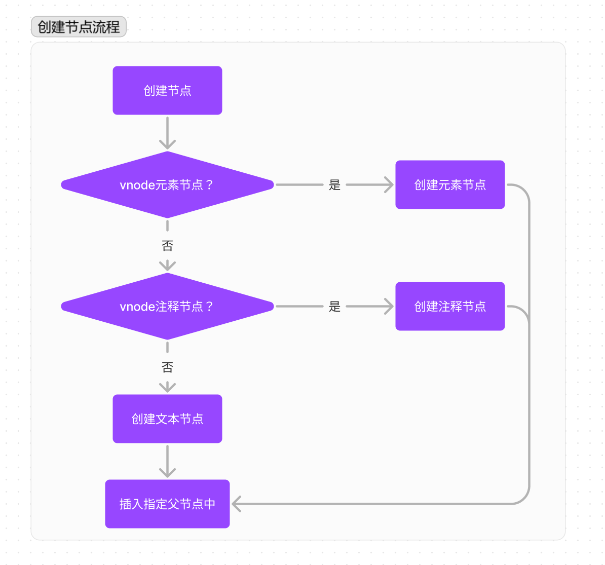

# patch

虚拟dom最核心的就是patch函数，它可以将vnode渲染成真实dom, patch也可以叫做patch算法，通过它可以渲染真实dom时，并不是暴力覆盖原有dom,而是对比新旧两个dom的区别，从而找出需要更新的节点进行更新。

之所以这么做，主要因为DOM操作的执行速度远不如JS的运算速度。因此把大量dom操作搬运到JS中，使用patching算法来计算出真正需要更新的节点，最大限度地减少DOM操作，从而显著提升性能。这本质其实是使用JS的运算成本来替换DOM操作的执行成本，而JS的运算速度要比DOM快的多，这样做很划算，所以才会有虚拟DOM.

对比两个vnode之间的差异只是patch的一个步骤。patch真正的目的是修改dom节点，也可以理解为渲染视图。

patch不是暴力替换节点，而是在现有DOM上进行修改来达到渲染视图的目的。对现有DOM进行修改需要做三件事情：

- 创建新增节点
- 删除废弃节点
- 修改需要更新的节点

## 新增节点

如果一个节点已经存在DOM中，那就不需要重新创建一个同样的节点去替换已经存在的节点。只有那些状态改变而新增的节点在DOM中并不存在时，才需要创建一个节点插入DOM中。所以场景就是当oldVnode不存在而vnode存在时，就需要使用vnode生成真实的DOM元素并将其插入到视图中去。

- 情况1：首次渲染。因为首次渲染不存在任何节点，这时oldVnode是不存在的
- 情况2：vnode与oldVnode完全不是同一个节点时，需要使用vnode生成真实dom元素并将其插入视图中，oldVnode废弃。

vnode是描述一个dom元素所需要的信息,所以需要通过vnode来创建真实的dom元素。根据vnode的类型来创建想通类型的DOM元素，然后将DOM元素插入到视图中。

事实上，只有三种类型的节点会被创建并插入到DOM中：元素节点、注释节点和文本节点。

- 元素节点：判断vnode是否存在tag变量说明就是元素节点，接着就调用环境下`createElement`方法（浏览器下：document.createElement）来创建真是的元素节点。当一个元素被创建后接下来要做的就是将它插入到指定的父节点中。
- 注释节点：判断vnode的isComment 是否为true。
- 文本节点：判断vnode的isComment为false, 且tag为undefined，说明是文本节点。

将元素渲染到视图，只需要调用当前环境下 `appendChild`方法（浏览器下：parentNode.appendChild）,就可以讲一个元素插入到指定的父节点中。如果父节点已经渲染到视图中，那么把元素插入到它的下面将会自动将元素渲染到视图中。

创建子节点过程就是递归，vnode中的children属性保存了当前的所以子虚拟节点（child virtual node）,所以只需要将vnode中的children属性循环一次,将每个子虚拟节点都执行一次创建元素逻辑。

创建子节点时，子节点的父节点就是当前刚创建出来的这个节点，所以子节点被创建后，会被插入到当前节点下面。当前所有子节点都创建完并插入到当前节点中之后，就把当前节点插入到指定父节点下面。如果这个指定父节点已经在视图中，那么将当前这个节点插入进去之后，会将当前节点包括子节点渲染到视图中。

文本节点需要调用当前环境下 `createTextNode`方法（浏览器下：document.createTextNode）来创建真实的文本并将其插入到指定父节点下

注释节点需要调用当前环境下 `createComment`方法（浏览器下：document.createComment）来创建真实的注释节点并将其插入到指定父节点下




## 删除节点

当一个节点只存在于oldVnode中，这时需要把它从DOM中删除。因为视图以vnode为标准，所以vnode中不存在的节点都属于被废弃的节点，所以需要从dom中删除


下面代码为什么不直接调用,而是进行一层封装， 比如删除节点为什么不直接`parent.removeChild(child)`删除节点，而是将这个节点操作进行封装成函数放到nodeOps。这里就涉及到跨平台渲染，Vue是兼容阿里weex平台可以让我们使用相同组件模型为ios和android编写原生渲染的应用。写Vue组件可以分别在ios和android环境中进行原生渲染。

而跨平台渲染本质是在设计框架的时候，要让框架渲染机制和DOM解耦。只要把框架更新DOM时的节点操作进行封装，就可以实现跨平台渲染，在不同平台下调用节点的操作


```ts
var namespaceMap = {};

function createElement$1 (tagName) {
  return document.createElement(tagName)
}

function createElementNS (namespace, tagName) {
  return document.createElement(namespace + ':' + tagName)
}

function createTextNode (text) {
  return new TextNode(text)
}

function createComment (text) {
  return document.createComment(text)
}

function insertBefore (
  node,
  target,
  before
) {
  if (target.nodeType === 3) {
    if (node.type === 'text') {
      node.setAttr('value', target.text);
      target.parentNode = node;
    } else {
      var text = createElement$1('text');
      text.setAttr('value', target.text);
      node.insertBefore(text, before);
    }
    return
  }
  node.insertBefore(target, before);
}

function removeChild (node, child) {
  if (child.nodeType === 3) {
    node.setAttr('value', '');
    return
  }
  node.removeChild(child);
}

function appendChild (node, child) {
  if (child.nodeType === 3) {
    if (node.type === 'text') {
      node.setAttr('value', child.text);
      child.parentNode = node;
    } else {
      var text = createElement$1('text');
      text.setAttr('value', child.text);
      node.appendChild(text);
    }
    return
  }

  node.appendChild(child);
}

function parentNode (node) {
  return node.parentNode
}

function nextSibling (node) {
  return node.nextSibling
}

function tagName (node) {
  return node.type
}

function setTextContent (node, text) {
  if (node.parentNode) {
    node.parentNode.setAttr('value', text);
  }
}

function setAttribute (node, key, val) {
  node.setAttr(key, val);
}

function setStyleScope (node, scopeId) {
  node.setAttr('@styleScope', scopeId);
}

var nodeOps = /*#__PURE__*/Object.freeze({
  namespaceMap: namespaceMap,
  createElement: createElement$1,
  createElementNS: createElementNS,
  createTextNode: createTextNode,
  createComment: createComment,
  insertBefore: insertBefore,
  removeChild: removeChild,
  appendChild: appendChild,
  parentNode: parentNode,
  nextSibling: nextSibling,
  tagName: tagName,
  setTextContent: setTextContent,
  setAttribute: setAttribute,
  setStyleScope: setStyleScope
});
```
```ts
function removeNode (el) {
  const parent = nodeOps.parentNode(el)
  // element may have already been removed due to v-html / v-text
  if (isDef(parent)) {
    nodeOps.removeChild(parent, el)
  }
}
function removeVnode(vnodes, startIndex, endIndex) {
  for(; startIndex <= endIndex, ++startIndex) {
    const ch = vnodes[startIndex]
    isDef(ch) && removeNode(ch.elm)
  }
}
```

## 更新节点

新增节点和删除节点，都有一个共同点，那就是两个虚拟节点完全不同。还有一个场景，就是新旧两个vnode, 存在差异性，这是就需要进行细致的比较，然后对oldVnode在视图中所对应的真实节点进行更新。

- 静态节点：在更新节点时，首先需要判断新旧两个vnode是否是静态节点（一旦渲染到页面上，状态就不会发生改变），如果是，就不需要进行更新操作，可以直接跳过更新节点过程。
- 文本节点：vnode有text属性且isComment为false（文本节点），就需要和oldVnode进行对比，如果想同则不进行任何操作，否则不用管oldVnode子节点是什么，直接调用setTextContent方法（在浏览器中node.textContent方法）来将视图中DOM节点的内容改为vnode的text属性所保存的属性。
- 元素节点：vnode tag属性有值。元素节点通常有children属性，但也有可能没有子节点，所以存在两种情况：
  - 新旧vnode有children属性,那么要对新旧两个虚拟节点的children进行更详细的对比并更新（可能会移动某个子节点，删除或新增某个子节点）
  - oldVnode没有children,说明旧节点可能是空标签或者文本，如果是文本就清空文本，然后将新的虚拟节点中的children循环创建真实DOM元素节点，并将其插入到视图中的DOM节点下面
  - 新vnode没有children, 说明新创建的节点是一个空节点。这时oldVnode有子节点就删除，最后达到空标签效果。


## 更新子节点（更新策略）

更新子节点大概可以分为4中操作：更新节点、新增节点、删除节点、移动节点位置。因此更新子节点更多的是在讨论什么情况下需要更新节点，什么情况下新增节点等。

更新子节点首先要对比两个子节点有哪些不同，然后针对不同的情况作不同处理。

对比连个子节点列表，首先需要循环newChildren,每循环到一个新子节点，就去oldChildren中找到和当前节点想同那个旧节点。如果oldChildren找不到，说明当前子节点是由状态变化而新增的节点，就需要创建视图操作；如果找到了，就做更新操作；如果找到的旧子节点的位置和新节点的不同，则需要移动节点等。

### 创建子节点

循环newChildren, 然后用当前节点，去oldChildren中寻找，所以创建节点的操作是在循环体内执行的，其具体实现是在oldChildren中寻找本次循环所指向的新子节点。

如果oldChildren中没有找到与本次循环的节点，那么说明本次循环所节点是一个新增节点。对于新增节点，需要执行创建节点的操作，并将创建的节点**插入到oldChildren中所有未处理节点（没有经过任何更新的操作的节点）的前面**。当节点成功插入dom后，这一轮循环结束。

### 更新子节点、

### 移动子节点

### 删除子节点

## 优化策略

### 新前与旧前

### 新后与旧后

### 新后与旧前

### 新前与旧后

## 哪些节点未处理过

## 总结


